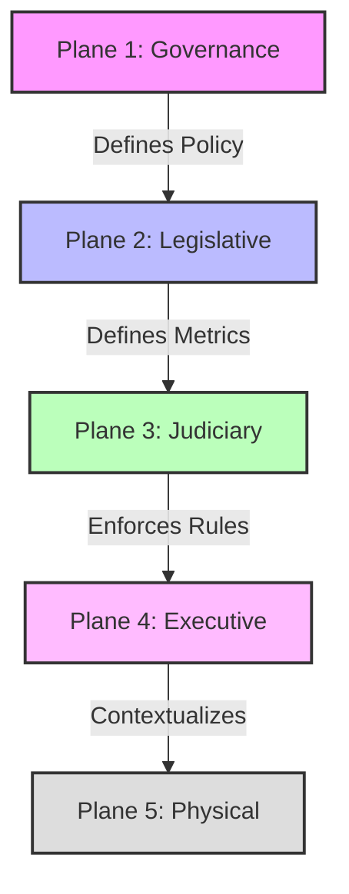
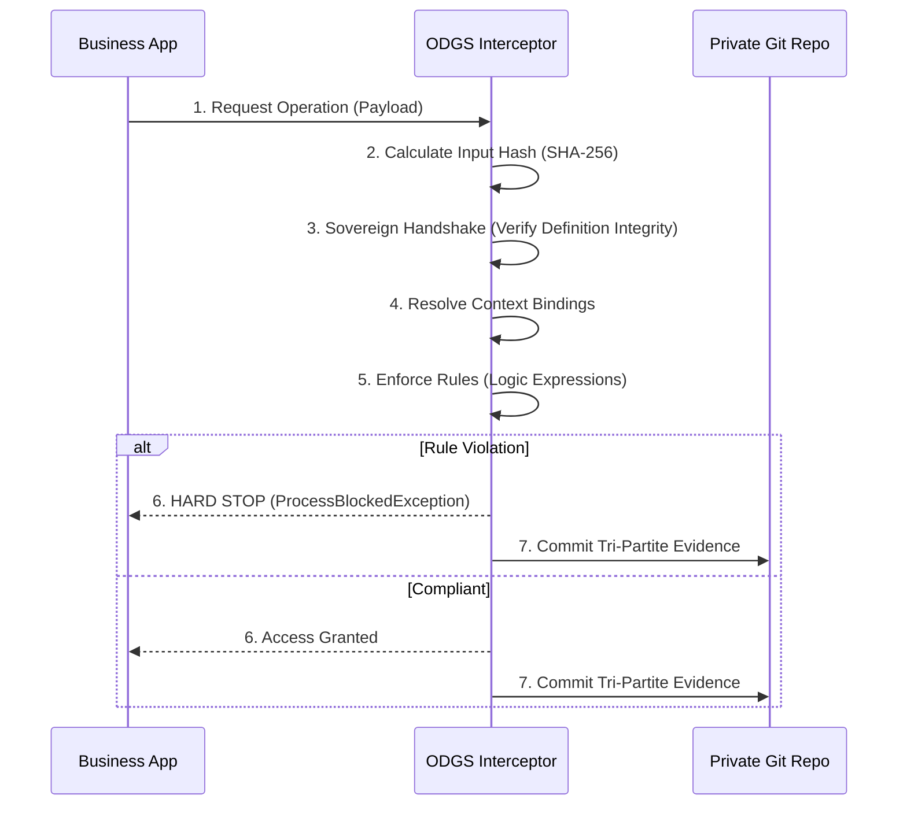

# ODGS Technical Specification: 00 - Architecture
**Status:** ISO/IEC 42001 Candidate Standard
**Version:** 3.3.0
**Type:** Normative

## 1. Abstract
The Open Data Governance Standard (ODGS) defines a **Hierarchical Constitutional Stack** for Data Governance. It strictly separates the Definition of Data (Legislative Plane) from the Execution of Data (Physical Plane), resolving the "Definition-Execution Gap" in High-Risk AI systems.

The core architectural pattern is the **"Sovereign Sidecar"**, where governance rules are enforced by a lightweight Interceptor that has *zero* hardcoded logic, relying entirely on immutable JSON configurations.

## 2. The Five Planes
The ODGS architecture is composed of five distinct planes of concern, flowing from human intent down to machine execution.

### Plane 1: Legislative (The Definition)
*   **Role:** Defines the semantic truth (What does "Revenue" mean?).
*   **Artifact:** `01-metrics-schema.json`, `ontology_graph.json`
*   **Immutability:** MUST be cryptographically hashed to prevent drift.

### Plane 2: Judiciary (The Enforcer)
*   **Role:** Validates data against the Legislative definition using logic expressions.
*   **Artifact:** `02-rules-schema.json`, `root_causes.json`
*   **Mechanism:** "Hard Stop" (ProcessBlockedException).
*   **Safe Execution:** Uses `simpleeval` for secure, non-turing-complete logic evaluation.

### Plane 3: Executive (The Context)
*   **Role:** Maps abstract definitions to specific business contexts (e.g., "Fiscal Year 2024").
*   **Artifact:** `runtime_config.json`, `physical_data_map.json`
*   **Responsibility:** The `OdgsInterceptor` (Sidecar) lives here.

### Plane 4: System (The Interface)
*   **Role:** Manages Input/Output and user interaction.
*   **Artifact:** Standardized CLI & API.
*   **Implementations:**
    *   **Python:** `2_INFORMATIVE_REFERENCE/src/odgs/cli.py` (Backend Ops)
    *   **Node.js:** `lib/index.js` (Frontend/Tooling)

### Plane 5: Audit (The Record)
*   **Role:** Provides forensic evidence of compliance (EU AI Act Article 12).
*   **Artifact:** `audit_log_schema.json` (Tri-Partite Binding).
*   **Storage:** Git-as-Backend (Zero-Trust Sovereignty).

---

## 3. The Sovereign Sidecar (Enforcement Mechanism)
The `OdgsInterceptor` is the core enforcement mechanism. It sits as a sidecar to any data process.

### Sequence Diagram

### Tri-Partite Binding (Article 12)
To meet EU AI Act Article 12 (Record-Keeping), every audit log entry cryptographically binds three elements:
1.  **The Event:** `SHA-256(Input Data Payload)`
2.  **The Law:** `SHA-256(Legislative Definitions)`
3.  **The Configuration:** `SHA-256(Runtime Context)`

This ensures that a log entry proves not just *what* happened, but *why* it was allowed/blocked at that exact moment in time.

## 4. API Surface
The system exposes a lightweight FastAPI interface (`2_INFORMATIVE_REFERENCE/src/odgs/system/api.py`).

| Endpoint | Method | Purpose |
| :--- | :--- | :--- |
| `/api/sovereign/intercept` | POST | Main enforcement point. Accepts process URN and data context. Returns GRANTED/BLOCKED. |
| `/api/sovereign/logs` | GET | Verification endpoint to view the immutable audit trail. |
| `/api/sovereign/hash` | GET | Returns the current master hash of the governance definition (The "Passport"). |

## 5. Normative References
*   **EU AI Act**: Article 10 (Governance), Article 12 (Logging).
*   **ISO/IEC 42001**: Control B.7 (Data Management).

---
[< Back to README.md](/README.md)
 | [Documentation Map →](index.md) | 🎯 [Live Demo →](https://demo.metricprovenance.com)
