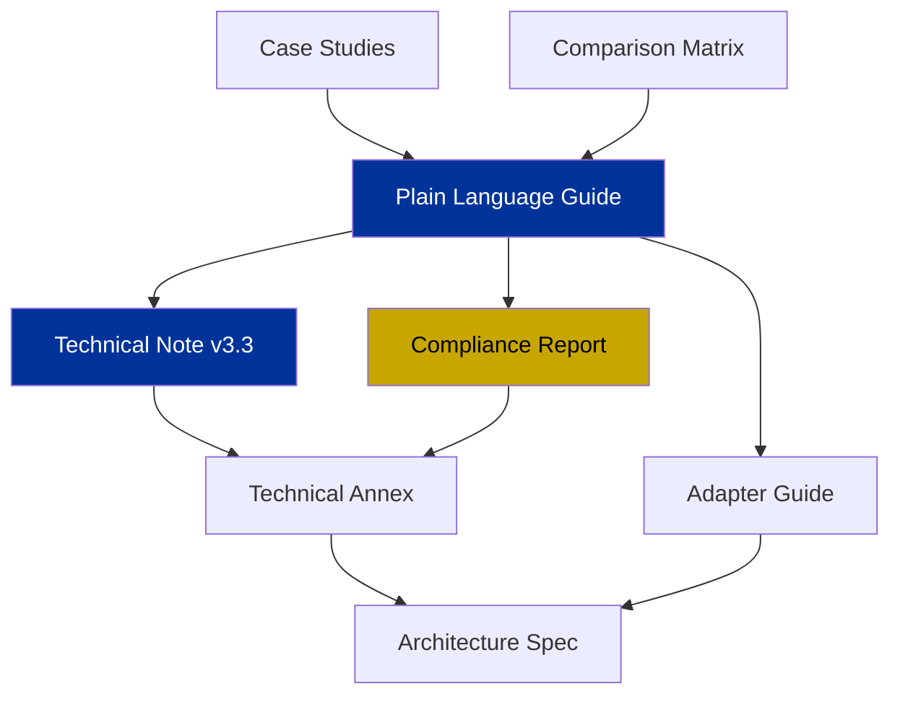

# ODGS Documentation

> Complete documentation for the Open Data Governance Standard — organized by audience.

---

## Quick Navigation

| Your Role | Start Here | Then Read |
|---|---|---|
| **Executive / Board** | [Plain Language Guide](eli5_guide.md) | [Technical Note v3.3](research/technical_note_v33.md) |
| **Chief Data Officer** | [Plain Language Guide](eli5_guide.md) | [Technical Annex](technical_annex.md) |
| **Compliance Officer** | [Compliance Report](compliance_report.md) | [Technical Annex](technical_annex.md) |
| **Regulator / Auditor** | [Compliance Report](compliance_report.md) | [Architecture Spec](architecture.md) |
| **Academic / Researcher** | [Technical Note v3.3](research/technical_note_v33.md) | [Technical Annex](technical_annex.md) |
| **Data Engineer** | [Adapter Guide](adapter_guide.md) | [Plain Language Guide](eli5_guide.md) |
| **General Public** | [Plain Language Guide](eli5_guide.md) | [Comparison Matrix](comparison_matrix.md) |

---

## 🎯 Live Demo

> **[demo.metricprovenance.com](https://demo.metricprovenance.com)** — Interactive Streamlit dashboard with live governance metrics, harvester sources, and protocol architecture.

---

## All Documents

### For Understanding
| Document | Description |
|---|---|
| [Plain Language Guide](eli5_guide.md) | What ODGS is, in plain English with screenshots |
| [Comparison Matrix](comparison_matrix.md) | How ODGS compares to traditional data governance tools |
| [Case Studies](case_studies.md) | Real-world scenarios and outcomes |

### For Strategy
| Document | Description |
|---|---|
| [Technical Note v3.3](research/technical_note_v33.md) | Sovereign Handshake, Tri-Partite Binding, Sovereign Harvester, OWL Ontology |

### For Implementation
| Document | Description |
|---|---|
| [Technical Annex](technical_annex.md) | Architecture, standards alignment, formal ontology |
| [Adapter Guide](adapter_guide.md) | How to integrate ODGS with your platform |
| [Architecture Specification](architecture.md) | Normative 5-Plane reference architecture |

### For Compliance
| Document | Description |
|---|---|
| [Compliance Report](compliance_report.md) | EU AI Act, GDPR, ISO 42001, Basel III alignment evidence |

---

## Document Relationships

---

*Protocol v3.3.0 · Sovereign Edition*
