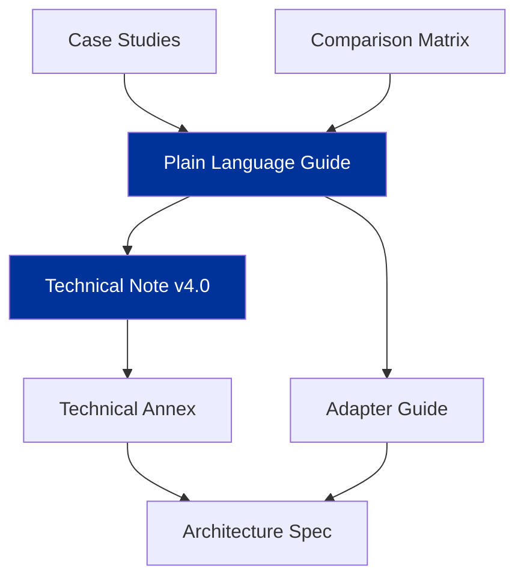

# ODGS Documentation

> Complete documentation for the Open Data Governance Standard — organized by audience.

---

## 🏢 Enterprise Compliance & EU AI Act Solutions

While the open-source ODGS engine executes local rules, **High-Risk AI Systems** require cryptographically sealed, immutable governance logs to satisfy Article 12 of the EU AI Act and avoid strict liability.

**[Metric Provenance](https://metricprovenance.com/brief)** offers the commercial Enterprise Infrastructure for ODGS:
* **The S-Cert Sovereign Registry:** An air-gapped Enterprise Certificate Authority that mints immutable, JWS-sealed audit logs of every AI decision.
* **Certified Sovereign Packs:** Pre-compiled, cryptographically signed Ed25519 rule bundles for EU AI Act, DORA, and Basel compliance.

👉 **[Discover the Sovereign CA Enterprise Node & Packs](https://metricprovenance.com/brief)**

---

## Quick Navigation

| Your Role | Start Here | Then Read |
|---|---|---|
| **Executive / Board** | [Plain Language Guide](eli5_guide.md) | [Technical Note v4.0](research/technical_note_v40.md) |
| **Chief Data Officer** | [Plain Language Guide](eli5_guide.md) | [Technical Annex](technical_annex.md) |
| **Compliance Officer** | [Technical Annex](technical_annex.md) | [Architecture Spec](architecture.md) |
| **Regulator / Auditor** | [Technical Annex](technical_annex.md) | [Architecture Spec](architecture.md) |
| **Academic / Researcher** | [Technical Note v4.0](research/technical_note_v40.md) | [Technical Annex](technical_annex.md) |
| **Data Engineer** | [Adapter Guide](adapter_guide.md) | [Plain Language Guide](eli5_guide.md) |
| **General Public** | [Plain Language Guide](eli5_guide.md) | [Comparison Matrix](comparison_matrix.md) |

---

## 🎯 See It In Action

> **[Watch the demo](https://www.metricprovenance.com/watch)** — the real engine compiling and enforcing a signed rule pack, with a genuine cryptographic audit trail.

---

## All Documents

### For Understanding
| Document | Description |
|---|---|
| [Plain Language Guide](eli5_guide.md) | What ODGS is, in plain English with screenshots |
| [Comparison Matrix](comparison_matrix.md) | How ODGS compares to traditional data governance tools |
| [Case Studies](case_studies.md) | Real-world scenarios and outcomes |

### For Strategy
| Document | Description |
|---|---|
| [Technical Note v4.0](research/technical_note_v40.md) | Universal Validation Primitive, Agnostic Tri-Partite Binding, BYOI/BYOB Extensibility |

### For Implementation
| Document | Description |
|---|---|
| [Technical Annex](technical_annex.md) | Architecture, standards alignment, formal ontology |
| [Adapter Guide](adapter_guide.md) | How to integrate ODGS with your platform |
| [Architecture Specification](architecture.md) | Normative 5-Plane reference architecture |

---

## Document Relationships

```mermaid
graph TD
    ELI5["Plain Language Guide"] --> TN["Technical Note v4.0"]
    ELI5 --> AG["Adapter Guide"]
    TN --> TA["Technical Annex"]
    TA --> ARCH["Architecture Spec"]
    AG --> ARCH
    CS["Case Studies"] --> ELI5
    CM["Comparison Matrix"] --> ELI5

    style ELI5 fill:#003399,color:#fff
    style TN fill:#003399,color:#fff
```

---

*Protocol v6.0.0 · Sovereign Validation Engine Edition*

---
> **Require architectural clearance or SLA support for your organization?** [Consult the Sovereign S-Cert Registry](https://metricprovenance.com/brief).
