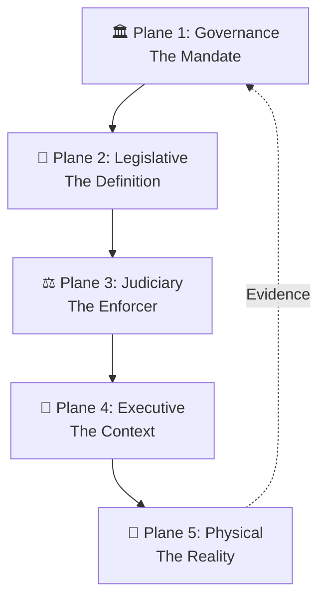
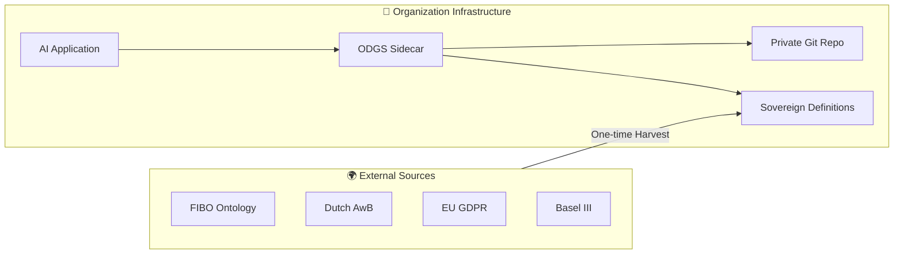
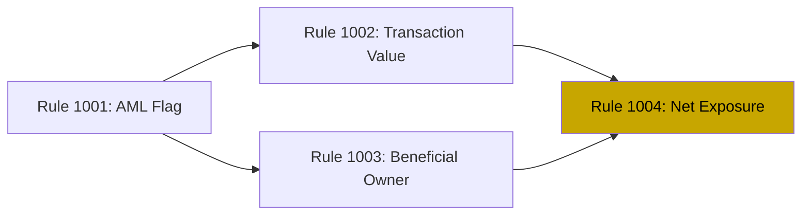

---

# TECHNICAL SPECIFICATION: THE ODGS PROTOCOL

**SUBJECT:** Runtime Enforcement, Data Sovereignty & ISO 42001 Alignment
**VERSION:** 6.0.0 (Sovereign Validation Engine)
**DATE:** March 2026
**DOI:** 10.5281/zenodo.18564270
**CLASSIFICATION:** Public Specification

---

## 1. ABSTRACT

The Open Data Governance Standard (ODGS) resolves the "Definition-Execution Gap" in High-Risk AI systems — the structural disconnect between what data governance *says* and what data pipelines *do*. It provides a vendor-neutral protocol to enforce **Administrative Safety** by strictly separating Policy (The Legislative Plane) from Execution (The Physical Plane).

This document outlines the core architecture of the v6.0.0 release. It builds on the v5 Universal Validation Primitive with six deterministic engine enhancements — SOFT_STOP override-able severity, batch evaluation, rule dependency chains (DAG), webhook event emission, conformance self-checks, and rule versioning — collectively forming the "Sovereign Validation Engine" pattern:

| Standard | Articles/Clauses | ODGS Implementation |
|---|---|---|
| EU AI Act (2024/1689) | Articles 10, 12 | Data Quality + Automatic Event Recording |
| ISO/IEC 42001:2023 | Clauses 4–10, Controls B.4–B.10 | AI Management System |
| GDPR (2016/679) | Articles 5, 25, 30 | Privacy-Native Architecture |

---

## 2. CORE PHILOSOPHY: CONFIGURATION AS LAW

The foundational premise of ODGS is that **Data Definition must be decoupled from Data Execution.**

### The Problem

In traditional systems, governance logic is **embedded in application code**:

```python
# Legacy: Hard-coded governance
if transaction_price < 470000:
    approve()  # No semantic validation
```

This creates three failure modes:
1. **Policy Drift:** Code changes without governance review
2. **Silent Degradation:** Rules silently weaken over time
3. **Audit Opacity:** No forensic evidence of which rule was applied when

### The ODGS Solution

Governance logic is externalized in **immutable JSON Configuration Files** that are content-addressed (SHA-256), version-controlled, and legally traceable:

```json
{
  "rule_id": 2040,
  "name": "Chart of Accounts Validity",
  "logic_expression": "coa_code in coa_valid_list",
  "severity": "HARD_STOP",
  "urn": "urn:odgs:rule:2040"
}
```

**Result:**
- A policy change is a **configuration update**, not a software deployment
- The Interceptor enforces the new law **instantly** across all connected systems
- Every decision is **cryptographically bound** to the rule version that produced it

---

## 3. THE 5-PLANE ARCHITECTURE

ODGS implements a hierarchical "Constitutional Stack" where mechanical execution is legally bound by semantic definitions.


```mermaid
graph TB
    P1[🏛️ Plane 1: Governance<br/>The Mandate]
    P2[📜 Plane 2: Legislative<br/>The Definition]
    P3[⚖️ Plane 3: Judiciary<br/>The Enforcer]
    P4[🏢 Plane 4: Executive<br/>The Context]
    P5[🔌 Plane 5: Physical<br/>The Reality]
    
    P1 --> P2
    P2 --> P3
    P3 --> P4
    P4 --> P5
    
    P5 -.->|Evidence| P1
```

| Plane | Role | Key Artifact | ISO Control |
|---|---|---|---|
| **1. Governance** | Captures human intent and policy scope (e.g., "Zero Tolerance for Fraud") | Policy Documents | B.5.1 (AI Policy) |
| **2. Legislative** | The strict semantic definition of truth. 72 metrics, 101 rules, 57 DQ dimensions | `standard_metrics.json`, `standard_data_rules.json` | B.7 (Data Management) |
| **3. Judiciary** | The logic engine that validates data. If Data ≠ Definition → **Hard Stop** | `OdgsInterceptor` | B.9 (Operations) |
| **4. Executive** | Maps definitions to business contexts (e.g., "Fiscal Year 2026", "EU Region") | `business_process_maps.json` | B.10 (Monitoring) |
| **5. Physical** | Raw data streams, sensors, databases, APIs | Adapter Layer (Snowflake, PostgreSQL, etc.) | Infrastructure |

---

## 4. DATA SOVEREIGNTY: THE "GIT-AS-BACKEND" MODEL

To satisfy the strict data residency requirements of Dutch Administrative Law and the EU Data Strategy, the ODGS engine operates on a completely headless, **"Privacy-Native"** architecture that evaluates rules entirely offline.

### 4.1 The Sovereign Sidecar Pattern

The ODGS Interceptor operates as a lightweight "Sidecar" within the host organization's infrastructure:


```mermaid
flowchart LR
    subgraph Organization["🏢 Organization Infrastructure"]
        App[AI Application] --> Sidecar[ODGS Sidecar]
        Sidecar --> Git[Private Git Repo]
        Sidecar --> Defs[Sovereign Definitions]
    end
    
    subgraph External["🌍 External Sources"]
        FIBO[FIBO Ontology]
        AwB[Dutch AwB]
        GDPR[EU GDPR]
        Basel[Basel III]
    end
    
    External -->|One-time Harvest| Defs
```

**Key guarantees:**

| Property | Implementation | Benefit |
|---|---|---|
| **Zero-Trust Logging** | Interceptor computes all proofs locally — no telemetry transmitted | Full data sovereignty |
| **Direct-to-Git Commit** | Audit logs committed to organization's private Git | Immutable evidence chain |
| **Content-Addressed Definitions** | SHA-256 hash of every sovereign definition | Tamper-evidence |
| **Offline Capable** | All definitions cached locally after harvest | No runtime dependencies |

**Result:** The Ministry retains 100% custody of the forensic evidence. The protocol provides the *schema*; the organization holds the *keys*.

### 4.2 The Sovereign Harvester

The Harvester fetches and content-addresses definitions from authoritative external sources:

```bash
# Harvest from 5 different trusted sources:
odgs harvest nl_awb 1:3          # Dutch Administrative Law
odgs harvest fibo InterestRate   # FIBO Financial Ontology
odgs harvest iso_42001 4         # ISO 42001 Clause 4
odgs harvest gdpr 25             # GDPR Article 25
odgs harvest basel CET1          # Basel III CET1 Capital Ratio
```

Each harvested definition is:
1. **Content-hashed** (SHA-256) at harvest time
2. **Stored locally** in `1_NORMATIVE_SPECIFICATION/schemas/sovereign/`
3. **Bound to metrics** via the Ontology Graph
4. **Version-stamped** for time-travel resolution

### 4.3 Air-Gapped Execution & Stateless Cryptography (JWKS)

The ODGS Universal Engine is strictly built for **Zero Telemetry** operations; it does not "phone home." This architecture is critical for Enterprise CISOs managing air-gapped, highly restricted, or sovereign cloud environments.

To ensure runtime integrity without active network dependency, the Engine verifies the provenance of Configuration Packs (Law Packs) locally using standard **Ed25519 JWKS (JSON Web Key Set)** public keys.

* **Stateless Integrity:** The Engine securely caches the public keys from a JWKS endpoint on startup. It then mathematically verifies the signature of every loaded policy package (e.g., EU AI Act) without conducting external database lookups during processing.
* **Decentralized Custody:** Organizations are explicitly encouraged to host their own internal JWKS registries for their proprietary, internal rules (`urn:odgs:custom:*`). This ensures the protocol remains 100% neutral and decentralized. Organizations rely on the Metric Provenance Root Authority *solely* for official, statutory Sovereign URNs (`urn:odgs:sov:*`).

---

## 5. THE v6.0.0 SOVEREIGN ENGINE ENHANCEMENTS

v6.0.0 introduces six deterministic, normative-additive capabilities to the Interceptor. All are backward-compatible — existing v5.x rule definitions continue to function without modification.

### 5.1 SOFT_STOP Override-able Severity

A new enforcement tier between `WARNING` and `HARD_STOP`. `SOFT_STOP` blocks the pipeline by default, but an authorized caller can supply a cryptographic `override_token` (any string; its SHA-256 hash is logged in the S-Cert) to proceed. This enables "controlled exception" workflows required by financial regulators (e.g., DORA operational resilience waivers).

### 5.2 Batch Evaluation

`intercept_batch()` evaluates multiple payloads against the same governance context in a single call. Returns an aggregated result with per-item pass/fail status. Supports `fail_fast` mode for early termination on first failure — critical for high-throughput data factory pipelines (Databricks, Airflow, dbt).

### 5.3 Rule Dependency Chains (DAG)

Rules can declare `depends_on: ["urn:odgs:rule:..."]` to form a directed acyclic graph. The engine resolves execution order using Kahn's algorithm (topological sort). If a dependency fails, all dependent rules are skipped with `DEPENDENCY_FAILED` status. Circular dependencies are detected and logged as warnings.


```mermaid
graph LR
    R1["Rule 1001: AML Flag"] --> R2["Rule 1002: Transaction Value"]
    R1 --> R3["Rule 1003: Beneficial Owner"]
    R2 --> R4["Rule 1004: Net Exposure"]
    R3 --> R4
    style R4 fill:#c7a600,color:#000
```

### 5.4 Webhook / Event Emission

Governance events (`BLOCKED`, `SOFT_STOP_OVERRIDE`, `SOFT_STOP_BLOCKED`) are dispatched to configured endpoints via `odgs.json`. This enables real-time SOC integration, SIEM alerting, and regulatory incident workflows.

### 5.5 Conformance Self-Check

`odgs conformance` CLI command verifies that an ODGS project meets structural requirements:
- **L1 (Basic):** Core plane artifacts exist (judiciary, legislative, executive)
- **L2 (Full):** Cross-references rule URNs in bindings against the rule index; validates sovereign hash consistency

### 5.6 Rule Versioning with Provenance

Rules declare `version` (semver). Versions are captured in every S-Cert audit entry under `rule_versions`, enabling full provenance tracking across rule lifecycle changes. Combined with `effective_from` / `effective_to` temporal bounds, this creates a complete audit trail of which rule version was active at any given point in time.

---

## 6. FORENSIC AUDITABILITY (ARTICLE 12 COMPLIANCE)

To satisfy the **"Automatic Recording of Events"** requirement (EU AI Act Art. 12) and enable completely agnostic forensic trails, the Interceptor guarantees that every execution outputs a zero-knowledge Tri-Partite Hash directly to a local Git directory (e.g., `.odgs/audit/`).

### 5.1 The Binding Schema

Every log entry cryptographically binds three elements:

| Element | What It Proves | Hash Source |
|---|---|---|
| **Input Data Hash** | *What* was processed (Privacy-Preserved) | SHA-256 of row payload |
| **Definition Hash** | *Which* rule was applied (Legislative Plane) | SHA-256 of sovereign definition |
| **Configuration Hash** | The *context* (Executive Plane) | SHA-256 of config version |

### 5.2 Sample Audit Log Entry

```json
{
  "event_id": "uuid-v4-signature",
  "timestamp": "2026-02-14T14:00:00Z",
  "outcome": "HARD_STOP",
  "reason": "SEMANTIC_DRIFT_DETECTED",
  "evidence": {
    "active_definition_hash": "sha256:7f9a2...",
    "input_payload_hash": "sha256:3b1c9...",
    "configuration_hash": "sha256:a2f1e...",
    "iso_control_ref": "ISO-42001-B.9"
  },
  "compliance_ref": "EU-AI-ACT-ART-10",
  "sovereign_binding": {
    "metric_urn": "urn:odgs:metric:101",
    "definition_urn": "urn:odgs:def:nl_gov:awb:art_1_3:v2024",
    "binding_weight": 1.0
  }
}
```

---

## 7. ARCHITECTURAL CASE STUDY: HOUSING FRAUD

*Why "Configuration as Law" prevents Administrative Failure.*

### The Scenario
A housing guarantee (NHG) limit is set at €470,000.

### Legacy System Failure
```
Hard-codes the check: Is Price < 470000?

Failure: If the market value is €300,000 but the transaction is artificially 
inflated to €460,000 (a "flip"), the Legacy System APPROVES it because the 
number is technically under the cap.

This is syntactically correct but semantically fraudulent.
```

### ODGS Prevention
```
1. The Interceptor checks the Legislative Plane
2. It retrieves the definition of "Valid Market Value" 
   (requires a Valuation Report, not just a Transaction Price)
3. The Judiciary Plane detects the gap: Price (€460k) vs Value (€300k)
4. It triggers a HARD STOP
5. The AI is physically prevented from issuing the guarantee
6. Evidence is cryptographically logged for Article 12 audit
```

**Outcome:** Administrative Recusal — "Silence over Error."

---

## 8. FORMAL ONTOLOGY

The ODGS knowledge graph is published as a **W3C OWL/RDF formal ontology** (`1_NORMATIVE_SPECIFICATION/ontology/ontology_graph.owl`), enabling:

- **Automated reasoning** via OWL DL reasoners (Protégé + HermiT)
- **SPARQL queries** for graph traversal
- **Linked Data** interoperability with external ontologies (FIBO, PROV-O)
- **Regulatory validation** — machine-readable proof of formal structure

---

## 9. CONCLUSION

The ODGS Protocol v6.0.0 offers a sovereign validation layer and deterministic method for **Administrative Recusal**. By prioritizing "Silence over Error," it ensures that High-Risk AI systems cannot operate outside their legal safety envelope, providing the necessary technical safeguards for public sector algorithms and regulated industries.

The protocol is:
- **Vendor-neutral** — JSON configuration, adapter pattern for any platform
- **Privacy-native** — zero telemetry, Git-backed evidence
- **Standards-aligned** — EU AI Act, ISO 42001, GDPR, Basel III
- **Formally specified** — W3C OWL/RDF ontology for machine-readable governance
- **Enterprise-ready** — SOFT_STOP waivers, batch pipelines, DAG dependency chains, webhook SOC integration

---
> **Require architectural clearance or SLA support for your organization?** [Consult the Sovereign S-Cert Registry](https://metricprovenance.com/brief).

[< Back to README.md](/README.md) | [Documentation Map →](index.md) | 🎯 [Watch the demo →](https://www.metricprovenance.com/watch)
