---

# TECHNICAL SPECIFICATION: THE ODGS PROTOCOL

**SUBJECT:** Runtime Enforcement, Data Sovereignty & ISO 42001 Alignment
**VERSION:** 3.3.0 (Sovereign / ISO-Ready)
**DATE:** February 2026
**DOI:** 10.5281/zenodo.18564270
**CLASSIFICATION:** Public Specification

---

## 1. ABSTRACT

The Open Data Governance Standard (ODGS) resolves the "Definition-Execution Gap" in High-Risk AI systems — the structural disconnect between what data governance *says* and what data pipelines *do*. It provides a vendor-neutral protocol to enforce **Administrative Safety** by strictly separating Policy (The Legislative Plane) from Execution (The Physical Plane).

This document outlines the core architecture of the v3.3.0 release, focusing on the **"Sovereign Sidecar"** pattern with Tri-Partite Binding and Sovereign Handshake integrity verification, designed for alignment with:

| Standard | Articles/Clauses | ODGS Implementation |
|---|---|---|
| EU AI Act (2024/1689) | Articles 10, 12 | Data Quality + Automatic Event Recording |
| ISO/IEC 42001:2023 | Clauses 4–10, Controls B.4–B.10 | AI Management System |
| NEN Committee 381 525 | Data, Cloud & Edge | Semantic Interoperability |
| GDPR (2016/679) | Articles 5, 25, 30 | Privacy-Native Architecture |

---

## 2. CORE PHILOSOPHY: CONFIGURATION AS LAW

The foundational premise of ODGS is that **Data Definition must be decoupled from Data Execution.**

### The Problem

In traditional systems, governance logic is **embedded in application code**:

```python
# Legacy: Hard-coded governance
if transaction_price < 470000:
    approve()  # No semantic validation
```

This creates three failure modes:
1. **Policy Drift:** Code changes without governance review
2. **Silent Degradation:** Rules silently weaken over time
3. **Audit Opacity:** No forensic evidence of which rule was applied when

### The ODGS Solution

Governance logic is externalized in **immutable JSON Configuration Files** that are content-addressed (SHA-256), version-controlled, and legally traceable:

```json
{
  "rule_id": 2040,
  "name": "Chart of Accounts Validity",
  "logic_expression": "coa_code in coa_valid_list",
  "severity": "HARD_STOP",
  "urn": "urn:odgs:rule:2040"
}
```

**Result:**
- A policy change is a **configuration update**, not a software deployment
- The Interceptor enforces the new law **instantly** across all connected systems
- Every decision is **cryptographically bound** to the rule version that produced it

---

## 3. THE 5-PLANE ARCHITECTURE

ODGS implements a hierarchical "Constitutional Stack" where mechanical execution is legally bound by semantic definitions.

```mermaid
graph TB
    P1[🏛️ Plane 1: Governance<br/>The Mandate]
    P2[📜 Plane 2: Legislative<br/>The Definition]
    P3[⚖️ Plane 3: Judiciary<br/>The Enforcer]
    P4[🏢 Plane 4: Executive<br/>The Context]
    P5[🔌 Plane 5: Physical<br/>The Reality]
    
    P1 --> P2
    P2 --> P3
    P3 --> P4
    P4 --> P5
    
    P5 -.->|Evidence| P1
```



| Plane | Role | Key Artifact | ISO Control |
|---|---|---|---|
| **1. Governance** | Captures human intent and policy scope (e.g., "Zero Tolerance for Fraud") | Policy Documents | B.5.1 (AI Policy) |
| **2. Legislative** | The strict semantic definition of truth. 72 metrics, 101 rules, 57 DQ dimensions | `standard_metrics.json`, `standard_data_rules.json` | B.7 (Data Management) |
| **3. Judiciary** | The logic engine that validates data. If Data ≠ Definition → **Hard Stop** | `OdgsInterceptor` | B.9 (Operations) |
| **4. Executive** | Maps definitions to business contexts (e.g., "Fiscal Year 2026", "EU Region") | `business_process_maps.json` | B.10 (Monitoring) |
| **5. Physical** | Raw data streams, sensors, databases, APIs | Adapter Layer (Snowflake, PostgreSQL, etc.) | Infrastructure |

---

## 4. DATA SOVEREIGNTY: THE "GIT-AS-BACKEND" MODEL

To satisfy the strict data residency requirements of Dutch Administrative Law and the EU Data Strategy, ODGS v3.3.0 operates on a **"Privacy-Native"** architecture.

### 4.1 The Sovereign Sidecar Pattern

The ODGS Interceptor operates as a lightweight "Sidecar" within the host organization's infrastructure:

```mermaid
flowchart LR
    subgraph Organization["🏢 Organization Infrastructure"]
        App[AI Application] --> Sidecar[ODGS Sidecar]
        Sidecar --> Git[Private Git Repo]
        Sidecar --> Defs[Sovereign Definitions]
    end
    
    subgraph External["🌍 External Sources"]
        FIBO[FIBO Ontology]
        AwB[Dutch AwB]
        GDPR[EU GDPR]
        Basel[Basel III]
    end
    
    External -->|One-time Harvest| Defs
```



**Key guarantees:**

| Property | Implementation | Benefit |
|---|---|---|
| **Zero-Trust Logging** | Interceptor computes all proofs locally — no telemetry transmitted | Full data sovereignty |
| **Direct-to-Git Commit** | Audit logs committed to organization's private Git | Immutable evidence chain |
| **Content-Addressed Definitions** | SHA-256 hash of every sovereign definition | Tamper-evidence |
| **Offline Capable** | All definitions cached locally after harvest | No runtime dependencies |

**Result:** The Ministry retains 100% custody of the forensic evidence. The protocol provides the *schema*; the organization holds the *keys*.

### 4.2 The Sovereign Harvester

The Harvester fetches and content-addresses definitions from authoritative external sources:

```bash
# Harvest from 5 different trusted sources:
odgs harvest nl_awb 1:3          # Dutch Administrative Law
odgs harvest fibo InterestRate   # FIBO Financial Ontology
odgs harvest iso_42001 4         # ISO 42001 Clause 4
odgs harvest gdpr 25             # GDPR Article 25
odgs harvest basel CET1          # Basel III CET1 Capital Ratio
```

Each harvested definition is:
1. **Content-hashed** (SHA-256) at harvest time
2. **Stored locally** in `1_NORMATIVE_SPECIFICATION/schemas/sovereign/`
3. **Bound to metrics** via the Ontology Graph
4. **Version-stamped** for time-travel resolution

---

## 5. FORENSIC AUDITABILITY (ARTICLE 12 COMPLIANCE)

To satisfy the **"Automatic Recording of Events"** requirement (EU AI Act Art. 12), the Interceptor generates a standardized JSON Audit Log for every inference event using the **Tri-Partite Binding**.

### 5.1 The Binding Schema

Every log entry cryptographically binds three elements:

| Element | What It Proves | Hash Source |
|---|---|---|
| **Input Data Hash** | *What* was processed (Privacy-Preserved) | SHA-256 of row payload |
| **Definition Hash** | *Which* rule was applied (Legislative Plane) | SHA-256 of sovereign definition |
| **Configuration Hash** | The *context* (Executive Plane) | SHA-256 of config version |

### 5.2 Sample Audit Log Entry

```json
{
  "event_id": "uuid-v4-signature",
  "timestamp": "2026-02-14T14:00:00Z",
  "outcome": "HARD_STOP",
  "reason": "SEMANTIC_DRIFT_DETECTED",
  "evidence": {
    "active_definition_hash": "sha256:7f9a2...",
    "input_payload_hash": "sha256:3b1c9...",
    "configuration_hash": "sha256:a2f1e...",
    "iso_control_ref": "ISO-42001-B.9"
  },
  "compliance_ref": "EU-AI-ACT-ART-10",
  "sovereign_binding": {
    "metric_urn": "urn:odgs:metric:101",
    "definition_urn": "urn:odgs:def:nl_gov:awb:art_1_3:v2024",
    "binding_weight": 1.0
  }
}
```

---

## 6. ARCHITECTURAL CASE STUDY: HOUSING FRAUD

*Why "Configuration as Law" prevents Administrative Failure.*

### The Scenario
A housing guarantee (NHG) limit is set at €470,000.

### Legacy System Failure
```
Hard-codes the check: Is Price < 470000?

Failure: If the market value is €300,000 but the transaction is artificially 
inflated to €460,000 (a "flip"), the Legacy System APPROVES it because the 
number is technically under the cap.

This is syntactically correct but semantically fraudulent.
```

### ODGS Prevention
```
1. The Interceptor checks the Legislative Plane
2. It retrieves the definition of "Valid Market Value" 
   (requires a Valuation Report, not just a Transaction Price)
3. The Judiciary Plane detects the gap: Price (€460k) vs Value (€300k)
4. It triggers a HARD STOP
5. The AI is physically prevented from issuing the guarantee
6. Evidence is cryptographically logged for Article 12 audit
```

**Outcome:** Administrative Recusal — "Silence over Error."

---

## 7. FORMAL ONTOLOGY

The ODGS knowledge graph is published as a **W3C OWL/RDF formal ontology** (`1_NORMATIVE_SPECIFICATION/ontology/ontology_graph.owl`), enabling:

- **Automated reasoning** via OWL DL reasoners (Protégé + HermiT)
- **SPARQL queries** for graph traversal
- **Linked Data** interoperability with external ontologies (FIBO, PROV-O)
- **Regulatory validation** — machine-readable proof of formal structure

---

## 8. CONCLUSION

The ODGS Protocol v3.3.0 offers a deterministic method for **Administrative Recusal**. By prioritizing "Silence over Error," it ensures that High-Risk AI systems cannot operate outside their legal safety envelope, providing the necessary technical safeguards for public sector algorithms and regulated industries.

The protocol is:
- **Vendor-neutral** — JSON configuration, adapter pattern for any platform
- **Privacy-native** — zero telemetry, Git-backed evidence
- **Standards-aligned** — EU AI Act, ISO 42001, NEN 381 525, GDPR, Basel III
- **Formally specified** — W3C OWL/RDF ontology for machine-readable governance

---
[< Back to README.md](/README.md)
 | [Documentation Map →](index.md) | 🎯 [Live Demo →](https://demo.metricprovenance.com)
