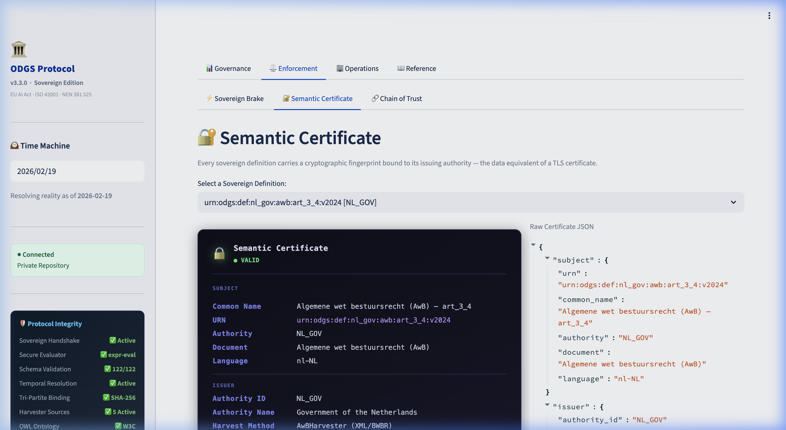
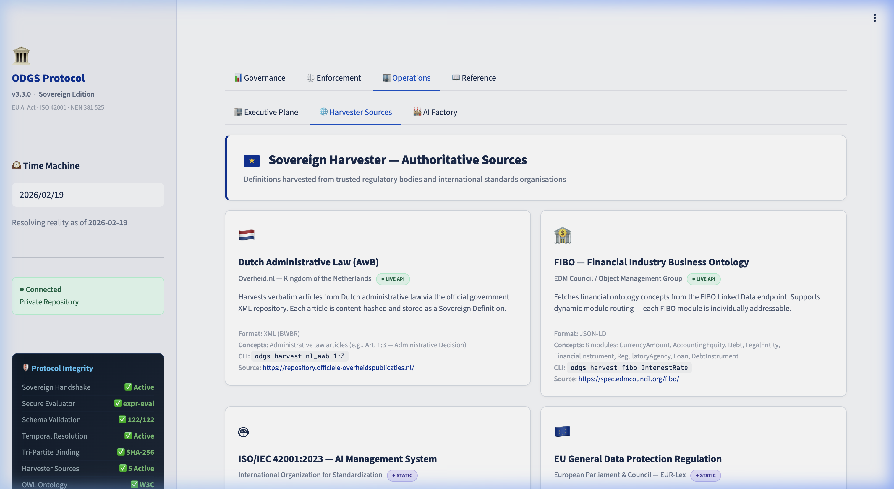
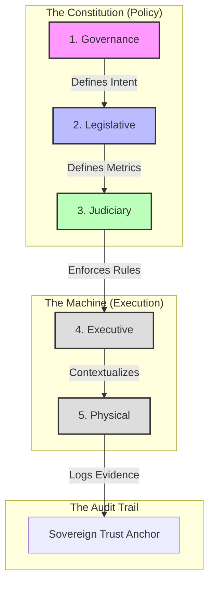

# Open Data Governance Standard (ODGS)

[-0055AA)](https://metricprovenance.com)
[](GOVERNANCE.md)
[](https://doi.org/10.5281/zenodo.18564270)

[](https://pypistats.org/packages/odgs)
[](https://www.npmjs.com/package/odgs)
[](LICENSE)

> **The Sovereign Reference Implementation for the EU AI Act.**

---

### 🏛️ Standards Refactor: CEN/CENELEC Candidate Standard (v3.3.0)

**Notice to all Contributors and Adopters (24 Feb 2026):**
The repository structure has been formally reorganized into a Candidate Standard format to support ongoing review by the **European CEN/CENELEC JTC 25 (Data & Cloud)** committee for Working Group 1 (Data Management) and Working Group 4 (Cloud and Edge). This aligns the protocol directly with the EU AI Act compliance mandates required by JTC 21.

To strictly enforce the semantic decoupling of policy from execution, all materials are now divided into:
1. `1_NORMATIVE_SPECIFICATION/`: Mandatory cryptographic schemas, rules, and W3C OWL ontologies.
2. `2_INFORMATIVE_REFERENCE/`: The software implementation (`odgs` engine), adapters, and documentation.

*This structure ensures our technical architecture mirrors the legal separation of powers required by European sovereign data regulations.*

---
### 📢 Sovereign Node Notice (19 Feb 2026)

**To the 240+ Sovereign Nodes currently running ODGS (v3.0.0):**

We have observed a significant spike in "Blind Clones" (direct CI/CD deployments) adhering to the EU AI Act (Article 10) requirements. We recognize that many of you are operating inside strict corporate firewalls (Banking/Gov/Logistics) and cannot interact publicly.

**We respect your sovereignty and do not track you.**

However, this release introduces **breaking changes** that may halt your production pipelines:

*   **URN Migration:** All integer IDs replaced with URN strings (`urn:odgs:metric:*`, `urn:odgs:rule:*`)
*   **Sovereign Handshake:** Cryptographic integrity verification now required before rule evaluation
*   **Tri-Partite Binding:** Audit logs now bind Input Hash + Definition Hash + Configuration Hash

> ⚠️ **OPERATIONAL ADVISORY:** To prevent "Definition Drift" in your critical paths, please click the **Watch** button (top right) → select **Releases Only**.

This ensures your Engineering Leads receive an immediate notification if a Schema Breaking Change is merged. This is the only channel we will use to broadcast critical compliance patches.

**Migration:** If upgrading from v3.0, run `odgs migrate` and see [MIGRATION_GUIDE.md](/MIGRATION_GUIDE.md).

## 1. The Standard
The **Open Data Governance Standard (ODGS)** is a vendor-neutral protocol for **Sovereign Data Governance**. It resolves the "Definition-Execution Gap" in High-Risk AI Systems by creating a deterministic method for **Administrative Recusal**.

> **"Silence over Error."** — The Core Philosophy.
> If the semantic definition of data drifts from its legal meaning, the system must execute a **Hard Stop** rather than process an invalid inference.

This repository contains the **Reference Implementation (v3.3.0)**, featuring the **Sovereign Handshake**, **Tri-Partite Binding**, and **86% enforceable rule coverage** for automated legislative compliance.

### See It In Action → [demo.metricprovenance.com](https://demo.metricprovenance.com)

**Semantic Certificate** — Every sovereign definition carries a cryptographic fingerprint bound to its issuing authority. The data equivalent of a TLS certificate.



<details>
<summary><b>📊 More Screenshots</b> — Compliance Matrix · Sovereign Brake · Harvester Sources</summary>

**Sovereign Compliance Matrix** — Real-time governance status across 72 business metrics, aligned with EU AI Act Art. 10 & 12.


**Sovereign Brake — Live Interceptor** — When data does not match its statutory definition, the system *refuses to proceed*. This is the "Administrative Recusal" principle.


**Sovereign Harvester — Authoritative Sources** — Definitions harvested from trusted regulatory bodies and international standards organisations.



</details>

---

## 2. Regulatory Alignment
This standard is architected to satisfy the "Error-Free Data" and "Automatic Recording" mandates of the Digital State:

* **🇪🇺 EU AI Act (2024/1689)**
    * **Article 10:** Validation of data provenance and semantic integrity.
    * **Article 12:** Generation of immutable, forensically sound event logs.
* **🇳🇱 NEN 381 525 (Data & Cloud)**
    * **Sovereignty:** Ensures data processing logic remains portable and vendor-independent.
* **🌐 ISO/IEC 42001 (AI Management)**
    * **Control B.9:** Operational control of AI systems via runtime enforcement.

---

## 3. The 5-Plane Architecture (v3.3)
ODGS implements a "Constitutional Stack" where mechanical execution is legally bound by semantic definitions via the **Sovereign Interceptor**.



**[> Read the Full Architecture Specification](/2_INFORMATIVE_REFERENCE/architecture/architecture.md)**

**🦉 [W3C OWL Ontology](/1_NORMATIVE_SPECIFICATION/ontology/ontology_graph.owl)** — 275 individuals (72 metrics, 50 rules, 60 dimensions, 42 process stages, 43 sovereign definitions) formally specified in OWL/RDF with W3C PROV provenance chains.

---

## 4. Technical Implementation: The Sovereign Stack

### 1. The Sovereign Harvester
Automatically fetch Legislative Definitions (XML/JSON-LD) and convert them into immutable `SovereignDefinition` objects.
*   **Dutch Law (AwB):** Harvests directly from `wetten.overheid.nl`.
*   **Finance (FIBO):** Harvests from the EDM Council Ontology.

### 2. Time-Travel Resolution
The **Sovereign Resolver** ensures legal accuracy by resolving URNs to the exact version effective on a specific date, preventing the "Resolution Trap".

### 3. The Interceptor (Python)
*   **Role:** Heavy-duty Data Engineering & Runtime Enforcement.
*   **Install:** `pip install odgs`

---

## 5. Quick Start (v3.3)

**1. Initialize a Sovereign Project**

```bash
odgs init my-project
cd my-project
```

**2. Harvest Sovereign Definitions**

Use the new `harvest` command to pull authoritative legal definitions:

```bash
# Harvest Dutch Administrative Law (Article 1:3)
odgs harvest nl_awb 1:3
# > [SUCCESS] Verified Signature.
# > Saved Immutable Definition: 1_NORMATIVE_SPECIFICATION/schemas/sovereign/nl_gov/awb_art_1_3.json

# Harvest Finance Ontology (Interest Rate)
odgs harvest fibo InterestRate
# > [SUCCESS] Verified Signature.
# > Saved Immutable Definition: 1_NORMATIVE_SPECIFICATION/schemas/sovereign/fibo/interestrate_v2024.json
```

**3. Define a Metric (The Law)**

Link your metric to the harvested Sovereign URN:

```bash
odgs add metric "ROIC" --definition "urn:odgs:def:fibo:interestrate:v2024"
# Links Return on Invested Capital to FIBO InterestRate (debt cost governs the denominator)
```

---

## 6. Documentation & Contribution

> 📚 **[Full Documentation Map →](2_INFORMATIVE_REFERENCE/architecture/index.md)** — All docs organized by audience (Executive, Compliance, Engineering, Research).
> 🎯 **[Live Demo →](https://demo.metricprovenance.com)** — Interactive dashboard with live governance metrics.

| Start Here | If You Are |
|---|---|
| [Plain Language Guide](2_INFORMATIVE_REFERENCE/architecture/eli5_guide.md) | Executive, CDO, General |
| [Compliance Report](2_INFORMATIVE_REFERENCE/architecture/compliance_report.md) | Compliance Officer, Regulator |
| [Adapter Guide](2_INFORMATIVE_REFERENCE/architecture/adapter_guide.md) | Data Engineer |
| [Technical Note v3.3](2_INFORMATIVE_REFERENCE/architecture/research/technical_note_v33.md) | Academic, Researcher |

### Contribute

This is a **Coalition of the Willing**. We invite Legal Scholars and Public Administrators to contribute to the Standard.

* **[Migration Guide (v3.0 -> v3.3)](/MIGRATION_GUIDE.md):** Critical instructions for upgrading.
* **[Changelog](/CHANGELOG.md):** Detailed record of changes.
* **[Governance Manifesto](/GOVERNANCE.md):** Principles of Regulatory Consensus.

### License

Released under the **Apache 2.0 License**.

* **No Vendor Lock-in.**
* **No Cloud Dependency.**
* **100% Data Sovereignty.**

---
> [!IMPORTANT]
> **Looking for the Flat JSON Version?**
> If you need the lightweight, non-cryptographic version (v1.2.x), visit the [Core Repository](https://github.com/MetricProvenance/odgs-core).
> *   **Install v1:** `pip install "odgs<2"`
> *   **Install v3 (This Repo):** `pip install odgs`

