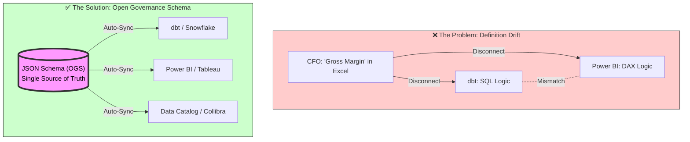

# 🏛️ The Open Data Governance Schema (ODGS)


> **The Open Standard for Headless Data Governance**  
> Decouples Business Logic from BI Tools

[]()
[]()
[](https://definitions.quirkyswirl.com)

[](https://opensource.org/licenses/Apache-2.0)
[](https://json.org)

## 📉 The Problem: Definition Drift

In the modern data stack, business logic is fragmented. The definition of `Gross Margin` in dbt often conflicts with the DAX formula in Power BI, which differs from the calculation in Tableau.

**Result:** Executives don't trust the dashboard, and Data Engineers spend 40% of their time debugging "why the numbers don't match."

## 🚀 The Solution: Write Once, Sync Everywhere




The **Open Data Governance Schema (ODGS)** is a vendor-neutral JSON protocol that acts as the "API" for your business definitions. By decoupling the **Definition** (The "What") from the **Tool** (The "How"), you achieve Headless Governance.

### How it works

```json
// example: standard_metrics.json
{
  "metric_id": "KPI_102",
  "name": "Gross_Margin",
  "domain": "Finance",
  "calculation_logic": {
    "abstract": "Revenue - COGS",
    "sql_standard": "SUM(gross_sales) - SUM(cost_of_goods)",
    "dax_pattern": "[Total Sales] - [Total Cost]"
  },
  "owner": "CFO_Office",
  "quality_threshold": "99.5%"
}
```

## 📂 The Protocol Structure

This repository contains the core schemas that define the "Alphabet" of Data Governance:

| File | Purpose |
| :--- | :--- |
| **`standard_metrics.json`** | The "Golden Record" for KPIs. Define logic, ownership, and sensitivity here. |
| **`standard_dq_dimensions.json`** | The 60 industry-standard dimensions of data quality (Accuracy, Timeliness, Completeness, etc.). |
| **`standard_data_rules.json`** | Technical validation rules (Regex patterns, null checks, referential integrity). |
| **`root_cause_factors.json`** | A standardized taxonomy for *why* data breaks (e.g., `Process_Gap` vs `Integration_Failure`). |
| **`business_process_maps.json`** | Maps how data entities flow through the business lifecycle. |

## ✅ Validation & CI/CD Integration

The repository includes a **validator script** that enforces the governance schema:

```bash
python3 validate_schema.py
```

**Output:**
```
🔍 Running Open Governance Schema Validator...
✅ Loaded 72 metrics.
✅ Loaded 50 data rules.
🎉 All Governance Checks Passed!
```

### CI/CD Integration

Add this to your GitHub Actions workflow to enforce governance standards:

```yaml
- name: Validate Governance Schema
  run: python3 validate_schema.py
```

This ensures that all metrics and rules have:
- Unique IDs
- Assigned owners
- Defined domains
- Clear calculation logic

---

## 🛠 Usage & Implementation

### Option A: Build your own Sync Engine

Fork this repository. Use these JSON files as the configuration layer in your CI/CD pipeline. Write Python/Node parsers to inject these definitions into your tools (dbt `schema.yml`, Power BI XMLA, etc.).

### Option B: The Reference Implementation

If you prefer a managed "Headless Governance" layer that natively supports ODGS and handles the sync to Power BI/dbt automatically, feel free to see the art of possible with these end-state applications built with the same data:

*   **[Clavis](https://clavis.iyer.dev/)** (Plain HTML, CSS, JS)
*   **[Chartr](https://chartr.quirkyswirl.com/)** (React v2)

These examples demonstrate the end outcome for the business user of what the Open Data Governance Schema can do.

## Commercial Managed Service Partners

For commercial managed services, please visit:
*   **[QuirkySwirl](https://quirkyswirl.netlify.app/about)** 

-----

## 📄 License

This project is licensed under the **Apache License 2.0** - see the [LICENSE](LICENSE) file for details.

Copyright © 2025 [Authentic Intelligence Labs](https://github.com/Authentic-Intelligence-Labs)

---

**Contributing:** We welcome Pull Requests to expand the `dq_dimensions` or refine the `root_cause_factors` taxonomy.