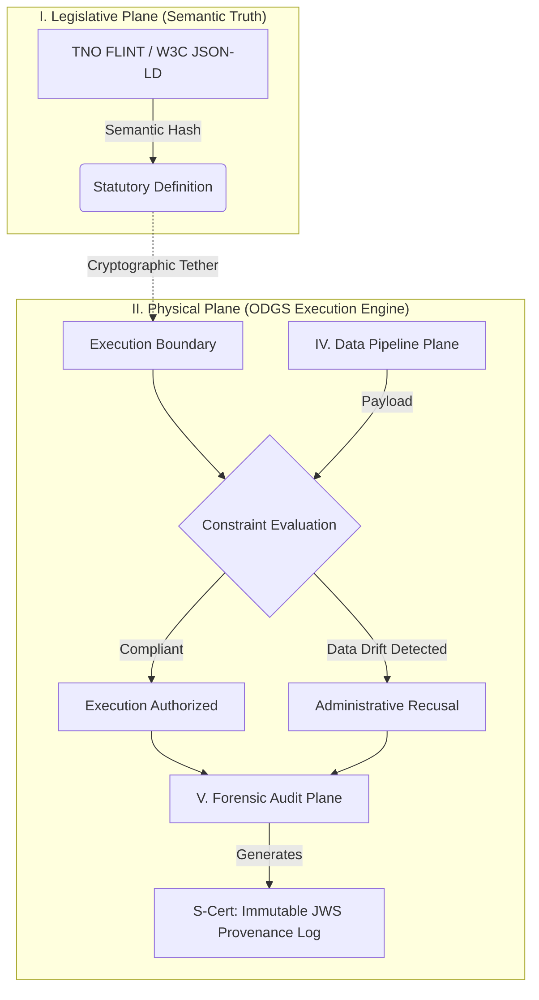

# Open Data Governance Standard (ODGS)

[-0055AA)](https://platform.metricprovenance.com)
[](GOVERNANCE.md)
[](https://doi.org/10.5281/zenodo.18564270)
[](https://pypistats.org/packages/odgs)
[](https://www.npmjs.com/package/odgs)
[](LICENSE)

> **The Universal Validation Engine for High-Risk Data.**
---
> [!IMPORTANT]
> **EU AI Act & CEN-CENELEC JTC 25 Candidate Standard (v5.0.0 Update)**
> ODGS has been upgraded to a strict Polymorphic Execution Engine. It seamlessly evaluates your standard operational telemetry while natively ingesting authoritative W3C/JSON-LD legal ontologies (e.g., TNO FLINT) to enforce **Administrative Recusal** ("Hard Stop") in High-Risk AI pipelines.
---

### 🚀 What's New in v5.0.0: The Execution Plane
In alignment with European Data Space architectures (NEN 381 525), ODGS v5 structurally repositions as the missing **Execution Plane** for Civic Tech and "Rules as Code" initiatives. 

* **Deprecation of NLP Harvesters:** We are no longer trying to solve the problem of "Reading the Law." We are exclusively solving the problem of "Cryptographically Enforcing the Law."
* **Authoritative JSON-LD Ingestion:** ODGS now natively delegates legal parsing to authoritative upstream sources (e.g., TNO FLINT). This eliminates vendor-specific legal interpretations and allows Sovereign States to act as their own Certificate Authorities.
* **Cryptographic Seals (SHA-256):** Ingestion now generates a deterministic hash at the physical boundary. If the upstream authoritative source changes its JSON-LD definition, the downstream cryptographic execution seal is instantly invalidated.

---
### 🏢 Enterprise & Public Sector: EU AI Act Compliance
This open-source package connects your physical data infrastructure to the ODGS validation engine. However, if you are operating a **High-Risk AI System** and require strict liability indemnification under the **EU AI Act (Articles 10 & 12)**, you need cryptographic provenance.

**Metric Provenance** offers the commercial Enterprise Infrastructure for ODGS:
* **Certified Sovereign Packs:** Pre-compiled, cryptographically signed Ed25519 rule bundles for DORA, EU AI Act, and Basel.
* **The S-Cert Sovereign Registry:** An air-gapped Enterprise Certificate Authority that natively ingests ODGS telemetry to mint immutable, JWS-sealed audit logs.

👉 **[Discover the Sovereign CA Enterprise Node & Packs](https://platform.metricprovenance.com)**

---

## 1. The Standard: Data Governance Without Compromise

The **Open Data Governance Standard (ODGS)** resolves the "Definition-Execution Gap" in data pipelines. 

> **"Silence over Error."** — The Core Philosophy.
> If data drifts from its legal, contractual, or internal definition, the pipeline must mathematically **halt** rather than process an invalid inference.

**Semantic Certificate** — Every sovereign definition carries a cryptographic fingerprint bound to its issuing authority. The data equivalent of a TLS certificate.


<details>
<summary><b>📊 More Screenshots</b> — Compliance Matrix · Sovereign Brake</summary>

**Sovereign Compliance Matrix** — Real-time governance status across 72 business metrics, aligned with EU AI Act Art. 10 & 12.


**Sovereign Brake — Live Interceptor** — When data does not match its statutory definition, the system *refuses to proceed*. This is the "Administrative Recusal" principle.


</details>

---

## 2. Quick Start: The Data Engineer Workflow

Stop relying on passive analytics dashboards. Enforce statutory rules directly in your Python transforms.

### Install
```bash
pip install odgs==5.0.0
```

### Example: Halting a Pipeline in Python/dbt

Inject ODGS directly into your data warehouse transforms, Airflow DAGs, or Databricks PySpark wrappers:

```python
from odgs.executive.interceptor import OdgsInterceptor
from odgs.executive.exceptions import AdministrativeRecusal

engine = OdgsInterceptor()

# The physical payload (e.g., an AI applicant profile or standard telemetry)
payload = {"transaction_value": 150000, "aml_flag": False}

try:
    # Evaluate against your internal checks or mathematically hashed W3C JSON-LD ontologies
    engine.intercept("urn:odgs:sov:eu-ai-act:aml-threshold", payload)
    print("Payload Validated. Proceeding to inference.")
    
except AdministrativeRecusal as e:
    # The pipeline HALTS before an illegal decision is made.
    print(f"HARD STOP EXECUTED: Data Drift Detected. {e}")
```

---

## 3. The 5-Plane Semantic Architecture (v5)

ODGS v5 implements a strict 5-Plane topology to guarantee the absolute sovereignty of legislative intent over physical execution pipelines.


```mermaid
graph TD
    subgraph Legislative_Plane ["I. Legislative Plane (Semantic Truth)"]
        FLINT[TNO FLINT / W3C JSON-LD] --> |Semantic Hash| Definition(Statutory Definition)
    end
    
    subgraph Physical_Plane ["II. Physical Plane (ODGS Execution Engine)"]
        Definition -.-> |Cryptographic Tether| Boundary[Execution Boundary]
        Boundary --> Eval{Constraint Evaluation}
        
        Pipeline[IV. Data Pipeline Plane] --> |Payload| Eval
        
        Eval --> |Compliant| Approved[Execution Authorized]
        Eval --> |Data Drift Detected| Recusal[Administrative Recusal]
        
        Approved --> Audit[V. Forensic Audit Plane]
        Recusal --> Audit
        
        Audit --> |Generates| SCert[S-Cert: Immutable JWS Provenance Log]
    end
```

---

## 4. Platform Bridges

ODGS bridges connect your existing data governance platform to the Execution Engine, transforming passive data dictionaries into active runtime enforcement.

| Bridge | Function | Status |
| --- | --- | --- |
| [`odgs-flint-bridge`](https://github.com/MetricProvenance/odgs-flint-bridge) | **Legislative:** Ingests TNO FLINT JSON-LD into ODGS schema. | [](https://pypi.org/project/odgs-flint-bridge-oss/) |
| [`odgs-collibra-bridge`](https://github.com/MetricProvenance/odgs-collibra-bridge) | **Physical:** Collibra Business Glossary integration. | [](https://pypi.org/project/odgs-collibra-bridge/) |
| [`odgs-databricks-bridge`](https://github.com/MetricProvenance/odgs-databricks-bridge) | **Physical:** Databricks Unity Catalog integration. | [](https://pypi.org/project/odgs-databricks-bridge/) |
| [`odgs-snowflake-bridge`](https://github.com/MetricProvenance/odgs-snowflake-bridge) | **Physical:** Snowflake Data Dictionary integration. | [](https://pypi.org/project/odgs-snowflake-bridge/) |

> **Want to build a bridge?** ODGS is designed to be the enforcement layer for *any* data governance platform. [Open an issue](https://github.com/MetricProvenance/odgs-protocol/issues) or submit a PR.

---

## 5. Air-Gapped Execution & Stateless Cryptography (JWKS)

The ODGS Engine operates with **Zero Telemetry** and does not "phone home". It is designed for strict air-gapped enterprise environments.

To ensure metric authenticity, ODGS implements stateless cryptography using standard **Ed25519 JWKS (JSON Web Key Set)** public keys. When the Engine loads a Sovereign Pack, it cryptographically verifies the signature against the cached JWKS public key.

---

## 6. Audit Ledgers: Cryptographic Verifiability & Zero-Knowledge

ODGS outputs an agnostic `cryptographic_attestation` JSON schema to satisfy **EU AI Act Article 12 (Forensic Logging)** without exposing third-party data.

* **Git-as-Backend:** ODGS utilizes a privacy-native logging architecture. Forensic logs are written directly to your private enterprise Git repository. **Zero data ever leaves your perimeter.**
* **The Tri-Partite Hash:** The engine generates a cryptographic proof binding the Input Data Hash + Rule Definition Hash + Engine Configuration Hash. Independent auditors and regulatory bodies can mechanically verify the integrity of algorithmic decisions without exposing PII.

---

## 7. Enterprise Deployment (Kubernetes / Helm)

For organization-wide policy enforcement, Sovereign Nodes can deploy ODGS as an active sidecar container routing mesh traffic.

```bash
# Add the Official Metric Provenance Repository
helm repo add metricprovenance https://charts.metricprovenance.com
helm repo update

# Install the Engine
helm install odgs-cluster-agent metricprovenance/odgs-engine \
  --set configuration.namespace="urn:odgs:sov" \
  --set keys.jwks_url="https://platform.metricprovenance.com/.well-known/jwks.json"
```

To request architectural clearance for your organization's compliance deployment, please consult the [Metric Provenance Enterprise Portal](https://platform.metricprovenance.com).

---

## 8. Documentation & Contribution

> 📚 **[Full Documentation Map →](2_INFORMATIVE_REFERENCE/architecture/index.md)**
> 🎯 **[Live Demo →](https://demo.metricprovenance.com)**

| Guide | Description |
| --- | --- |
| [Migration Guide (v4.0 -> v5.0)](MIGRATION_GUIDE.md) | Critical instructions for the Polymorphic Engine upgrade. |
| [Adapter Guide](2_INFORMATIVE_REFERENCE/architecture/adapter_guide.md) | For Data Engineers connecting ODGS to custom infrastructures. |
| [Audit Ledger Guide](2_INFORMATIVE_REFERENCE/architecture/audit_ledger_guide.md) | For Big 4 Auditors verifying the Tri-Partite Hash. |

---

### Support & Community

* **Bug Reports & Feature Requests:** Please use the [GitHub Issues](https://github.com/MetricProvenance/odgs-protocol/issues) tracker.
* **Enterprise Compliance Deployments:** For architectural clearance, SLA support, or custom Law Packs, please contact us via the [Enterprise Portal](https://platform.metricprovenance.com).

---

### License

Released under the **Apache 2.0 License**.

> * **No Vendor Lock-in.**
> * **No Cloud Dependency.**
> * **100% Data Sovereignty.**

---

ODGS | Developed by [Metric Provenance](https://metricprovenance.com) | The Hague, NL 🇳🇱