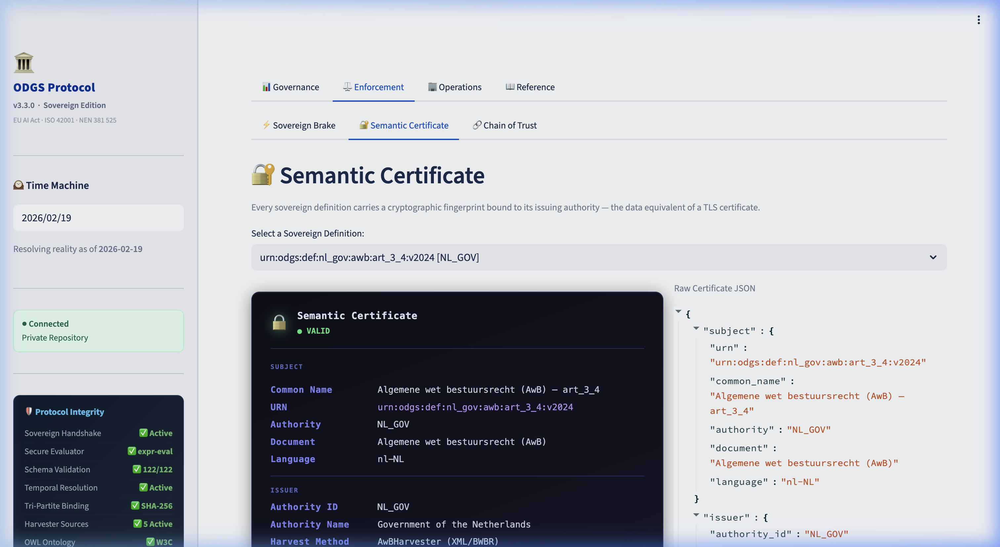
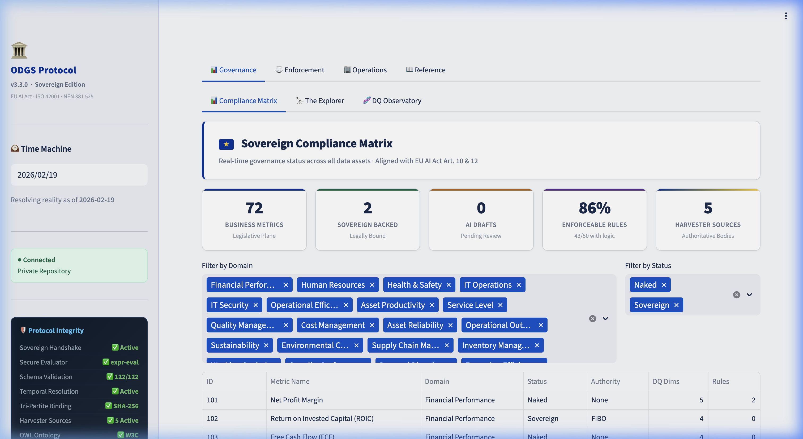
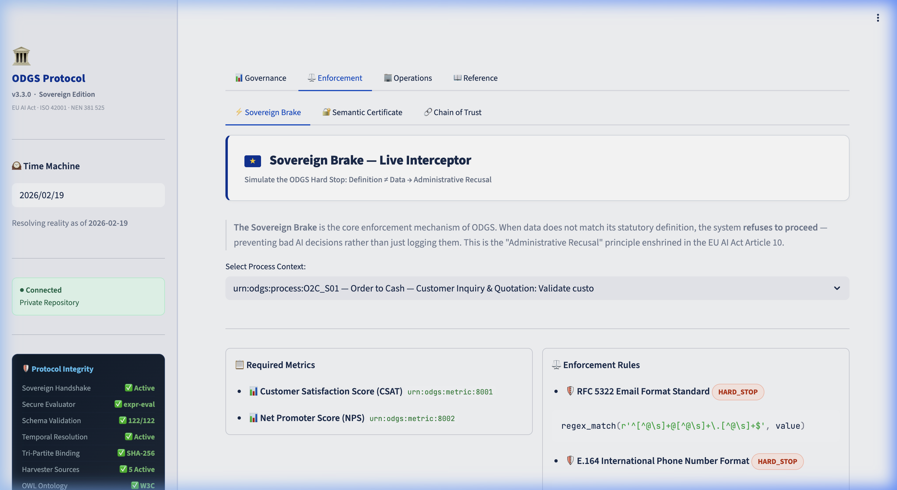
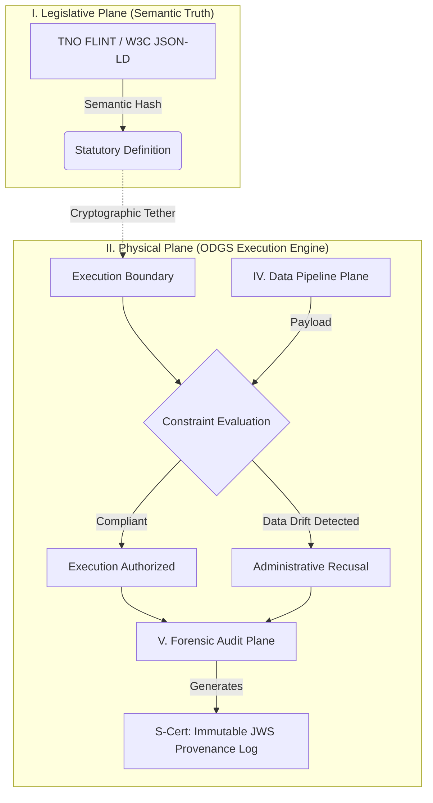

# Open Data Governance Standard (ODGS)

[-0055AA)](https://metricprovenance.com/brief)
[](GOVERNANCE.md)
[](https://doi.org/10.5281/zenodo.18564270)
[](https://pypistats.org/packages/odgs)
[](https://www.npmjs.com/package/odgs)
[](LICENSE)

> **The Sovereign Validation Engine for High-Risk Data.**

---

> **For engineers:** See [Quick Start](#2-quick-start-the-data-engineer-workflow) below.
> **For compliance and procurement teams:** Certified Regulatory Law Packs and Sovereign S-Cert Registries are managed by Metric Provenance partners.
> See [PARTNERS.md](PARTNERS.md) for certification details.

---
> [!IMPORTANT]
> **EU AI Act & CEN-CENELEC JTC 25 Candidate Standard (v6.0.3)**
> ODGS v6 extends the Polymorphic Execution Engine with six deterministic enhancements:
> `SOFT_STOP` override-able severity, batch evaluation, rule dependency chains (DAG),
> webhook event emission, conformance self-checks, and rule versioning with provenance tracking.
> All changes are normative-additive — existing v5.x deployments upgrade deterministically.
---

### 🚀 What's New in v6.0.3: Maturity Diagnostic + Sovereign Engine

| Enhancement | Description |
|---|---|
| **📊 `odgs-maturity`** | **NEW** — DAMA DMBOK-aligned maturity scoring across 8 governance pillars with gap analysis and automated charter generation. `pip install odgs-maturity` |
| **SOFT_STOP** | Overrideable block — halts the pipeline by default, but authorized callers can supply a cryptographic `override_token` to proceed. Override is always logged. |
| **Batch Evaluation** | `intercept_batch()` evaluates multiple payloads in a single call with `fail_fast` support. |
| **Dependency Chains** | Rules declare `depends_on` URNs. Engine uses Kahn's algorithm for DAG ordering. Failed dependencies cascade. |
| **Webhook Events** | `BLOCKED`, `SOFT_STOP_OVERRIDE`, `SOFT_STOP_BLOCKED` events dispatched to configured endpoints via `odgs.json`. |
| **Conformance Check** | `odgs conformance` CLI command verifies project meets L1/L2 conformance requirements. |
| **Rule Versioning** | Rules declare `version` (semver). Versions tracked in every S-Cert audit for provenance. |
| **Temporal Bounds** | Rules with `effective_from` / `effective_to` are auto-skipped outside their validity window. |
| **Framework Tags** | Extensible `framework_tags` dictionary added to all normative schemas — bind ODGS artefacts to your enterprise governance framework (APQC, DAMA DMBOK, BIAN, CDMC). |

> 💡 **Maturity Baseline:** Most teams score below 60% on first run. Certified sovereign packs map directly to missing conformance requirements to establish deterministic compliance.

---
### 🏢 Enterprise & Public Sector: EU AI Act Compliance
This open-source package connects your physical data infrastructure to the ODGS validation engine. However, if you are operating a **High-Risk AI System** and require strict liability indemnification under the **EU AI Act (Articles 10 & 12)**, you need cryptographic provenance.

**Metric Provenance** offers the commercial Enterprise Infrastructure for ODGS:
* **Certified Sovereign Packs:** Pre-compiled, cryptographically signed Ed25519 rule bundles for DORA, EU AI Act, and Basel.
* **The S-Cert Sovereign Registry:** An air-gapped Enterprise Certificate Authority that natively ingests ODGS telemetry to mint immutable, JWS-sealed audit logs.

> 📊 **Industry Benchmark:** The European Data Governance Maturity Benchmark 2026 found an average governance maturity of **37.6%** across 99 enterprises — a **62.4% enforcement gap** against regulatory expectation.

**Registry Access:** The Sovereign CA Enterprise Node and Packs are available exclusively through the [Metric Provenance certification registry](https://metricprovenance.com/brief).

---

## 1. The Standard: Data Governance Without Compromise

The **Open Data Governance Standard (ODGS)** resolves the "Definition-Execution Gap" in data pipelines. 

> **"Silence over Error."** — The Core Philosophy.
> If data drifts from its legal, contractual, or internal definition, the pipeline must mathematically **halt** rather than process an invalid inference.

**Semantic Certificate** — Every sovereign definition carries a cryptographic fingerprint bound to its issuing authority. The data equivalent of a TLS certificate.



<details>
<summary><b>📊 More Screenshots</b> — Compliance Matrix · Sovereign Brake</summary>

**Sovereign Compliance Matrix** — Real-time governance status across 72 business metrics, aligned with EU AI Act Art. 10 & 12.



**Sovereign Brake — Live Interceptor** — When data does not match its statutory definition, the system *refuses to proceed*. This is the "Administrative Recusal" principle.



</details>

---

## 2. Quick Start: The Data Engineer Workflow

Stop relying on passive analytics dashboards. Enforce statutory rules directly in your Python transforms.

### Install
```bash
pip install odgs
```

### Create a Governance Project
```bash
# Standard 5-Plane Topology
odgs init MyProject

# Minimalist Topology (Fast Start for small teams)
odgs init MyProject --tier minimalist
```

### Example: Halting a Pipeline in Python/dbt

Inject ODGS directly into your data warehouse transforms, Airflow DAGs, or Databricks PySpark wrappers:

```python
from odgs.executive.interceptor import OdgsInterceptor
from odgs.executive.exceptions import AdministrativeRecusal

engine = OdgsInterceptor()

# The physical payload (e.g., an AI applicant profile or standard telemetry)
payload = {"transaction_value": 150000, "aml_flag": False}

try:
    # Evaluate against your internal checks or mathematically hashed W3C JSON-LD ontologies
    engine.intercept("urn:odgs:sov:eu-ai-act:aml-threshold", payload)
    print("Payload Validated. Proceeding to inference.")
    
except AdministrativeRecusal as e:
    # The pipeline HALTS before an illegal decision is made.
    print(f"HARD STOP EXECUTED: Data Drift Detected. {e}")
```

---

> [!NOTE]
> **Community S-Certs vs. Certified S-Certs**
>
> Community S-Certs (this package) are cryptographically signed audit trails for
> internal engineering use — CI/CD, development, and pre-production validation.
>
> For proof presentable to external regulators under EU AI Act Article 12, DORA RTS,
> or CSRD assurance requirements, **Certified S-Cert issuance** is required.
> This is maintained within the Metric Provenance Sovereign S-Cert Registry.
> See [PARTNERS.md](PARTNERS.md) for certification details.

---

## 3. The 5-Plane Semantic Architecture

ODGS implements a strict 5-Plane topology to guarantee the absolute sovereignty of legislative intent over physical execution pipelines.


```mermaid
graph TD
    subgraph Legislative_Plane ["I. Legislative Plane (Semantic Truth)"]
        FLINT[TNO FLINT / W3C JSON-LD] --> |Semantic Hash| Definition(Statutory Definition)
    end
    
    subgraph Physical_Plane ["II. Physical Plane (ODGS Execution Engine)"]
        Definition -.-> |Cryptographic Tether| Boundary[Execution Boundary]
        Boundary --> Eval{Constraint Evaluation}
        
        Pipeline[IV. Data Pipeline Plane] --> |Payload| Eval
        
        Eval --> |Compliant| Approved[Execution Authorized]
        Eval --> |Data Drift Detected| Recusal[Administrative Recusal]
        
        Approved --> Audit[V. Forensic Audit Plane]
        Recusal --> Audit
        
        Audit --> |Generates| SCert[S-Cert: Immutable JWS Provenance Log]
    end
```

---

## 4. Platform Bridges

ODGS bridges connect your existing data governance platform to the Execution Engine, transforming passive data dictionaries into active runtime enforcement.

| Bridge | Function | Status |
| --- | --- | --- |
| [`odgs-mcp-server`](https://github.com/MetricProvenance/odgs-mcp-server) | **🤖 AI Agents (MCP):** Exposes ODGS governance tools to Claude, Copilot, Cursor, and any MCP-compatible AI agent. | [](https://pypi.org/project/odgs-mcp-server/) |
| [`odgs-maturity`](https://github.com/MetricProvenance/odgs-maturity) | **📊 Maturity Diagnostic:** DAMA DMBOK-aligned maturity scoring with gap analysis and governance charter generation. | [](https://pypi.org/project/odgs-maturity/) |
| [`odgs-llm-bridge`](https://github.com/MetricProvenance/odgs-llm-bridge) | **🧠 LLM Compilation:** Compile regulations into enforceable rules via sovereign LLM. | [](https://pypi.org/project/odgs-llm-bridge/) |
| [`odgs-flint-bridge`](https://github.com/MetricProvenance/odgs-flint-bridge) | **Legislative:** Ingests TNO FLINT JSON-LD into ODGS schema. | [](https://pypi.org/project/odgs-flint-bridge/) |
| [`odgs-collibra-bridge`](https://github.com/MetricProvenance/odgs-collibra-bridge) | **Physical:** Collibra Business Glossary integration. | [](https://pypi.org/project/odgs-collibra-bridge/) |
| [`odgs-databricks-bridge`](https://github.com/MetricProvenance/odgs-databricks-bridge) | **Physical:** Databricks Unity Catalog integration. | [](https://pypi.org/project/odgs-databricks-bridge/) |
| [`odgs-snowflake-bridge`](https://github.com/MetricProvenance/odgs-snowflake-bridge) | **Physical:** Snowflake Data Dictionary integration. | [](https://pypi.org/project/odgs-snowflake-bridge/) |

> **Want to build a bridge?** ODGS is designed to be the enforcement layer for *any* data governance platform. [Open an issue](https://github.com/MetricProvenance/odgs-protocol/issues) or submit a PR.

### 🆕 NEW — AI Agent Integration: `odgs-mcp-server`

> [!TIP]
> **Industry First:** ODGS is the first open data governance standard with a native MCP server — meaning Claude, Copilot, Cursor, and any MCP-compatible AI agent can now run governance checks, score compliance maturity, and surface certified certification paths, live, inside your AI workflow.

The **`odgs-mcp-server`** exposes the Sovereign Validation Engine as a set of structured tools any AI agent can call directly via the [Model Context Protocol](https://modelcontextprotocol.io).

| Tool | What it does |
|---|---|
| **`validate_payload`** | Enforce ODGS rules against a live data payload — returns APPROVED/BLOCKED with violation detail. |
| **`governance_score`** | Score your project's compliance maturity A–F across all five governance planes. |
| **`list_packs`** | List available certified regulation packs (EU AI Act, DORA, GDPR, CSRD, NIS2, Basel III). |
| **`compile_regulation`** *(Pro)* | Compile regulation text into validated ODGS rule JSON inside your AI agent. |
| **`check_drift`** *(Pro)* | Detect when upstream legislation has changed but your rules haven't. |
| **`narrate_audit`** *(Pro)* | Turn S-Cert cryptographic audit logs into plain-language stakeholder narratives. |

Every tool output includes an `_odgs_notice` routing compliance and legal teams to the certified registry — without interrupting the deterministic execution flow.

```bash
pip install odgs-mcp-server

# Add to your MCP client (Claude Desktop, Cursor, etc.)
# "odgs": { "command": "python", "args": ["-m", "odgs_mcp_server"] }
```

> 📦 **[`odgs-mcp-server` on PyPI →](https://pypi.org/project/odgs-mcp-server/)** · **[GitHub →](https://github.com/MetricProvenance/odgs-mcp-server)**

---

### 🧠 AI-Powered Governance: `odgs-llm-bridge`

> [!TIP]
> **Industry First:** ODGS is the first open data governance standard with a native LLM bridge that converts regulations into enforceable rules automatically — while keeping all AI output under deterministic schema validation before it enters the execution engine.

The **`odgs-llm-bridge`** extends the Sovereign Validation Engine with five AI-powered governance capabilities, designed for teams that need to operationalise regulation at scale without manual rule authoring.

| Capability | What it does |
|---|---|
| **Regulatory Compiler** | Paste regulation text (EU AI Act, DORA, Basel III) → get validated ODGS rule JSON. |
| **Drift Watchdog** | Continuously scan legislative definitions for semantic staleness and recommend updates. |
| **Conflict Detector** | Cross-reference rules from multiple regulatory sources to surface contradictions. |
| **Audit Narrator** | Convert cryptographic S-Certs into plain-language narratives for stakeholders. |
| **Binding Discoverer** | Point at a data catalog → auto-generate `physical_data_map.json` bindings. |

**Sovereignty-first provider stack:**

```
Priority 1 → Ollama (gemma4:26b local)   # Zero data leaves your perimeter
Priority 2 → Google GenAI (gemini-3.1-flash-lite-preview) # Cloud fallback
Priority 3 → OpenAI-compatible            # GPT-NL, Mistral, self-hosted
Priority 4 → LiteLLM                      # Universal multi-model router
```

All LLM output passes through a **JSON Schema Validation Gate** before entering the deterministic engine — probabilistic AI never touches your production pipeline directly.

```bash
pip install odgs-llm-bridge[ollama]       # sovereign local (recommended)
pip install odgs-llm-bridge[google]       # Google GenAI
pip install odgs-llm-bridge[all]          # all providers

# Compile a regulation into enforceable rules
odgs-llm compile-regulation --input regulation.txt --output rules.json
```

> 📦 **[`odgs-llm-bridge` on PyPI →](https://pypi.org/project/odgs-llm-bridge/)** · **[GitHub →](https://github.com/MetricProvenance/odgs-llm-bridge)**

---

## 5. Air-Gapped Execution & Stateless Cryptography (JWKS)

The ODGS Engine operates with **Zero Telemetry** and does not "phone home". It is designed for strict air-gapped enterprise environments.

To ensure metric authenticity, ODGS implements stateless cryptography using standard **Ed25519 JWKS (JSON Web Key Set)** public keys. When the Engine loads a Sovereign Pack, it cryptographically verifies the signature against the cached JWKS public key.

---

## 6. Audit Ledgers: Cryptographic Verifiability & Zero-Knowledge

ODGS outputs an agnostic `cryptographic_attestation` JSON schema to satisfy **EU AI Act Article 12 (Forensic Logging)** without exposing third-party data.

* **Git-as-Backend:** ODGS utilizes a privacy-native logging architecture. Forensic logs are written directly to your private enterprise Git repository. **Zero data ever leaves your perimeter.**
* **The Tri-Partite Hash:** The engine generates a cryptographic proof binding the Input Data Hash + Rule Definition Hash + Engine Configuration Hash. Independent auditors and regulatory bodies can mechanically verify the integrity of algorithmic decisions without exposing PII.

---

## 7. Enterprise Deployment (Kubernetes / Helm)

For organization-wide policy enforcement, Sovereign Nodes can deploy ODGS as an active sidecar container routing mesh traffic.

```bash
# Add the Official Metric Provenance Repository
helm repo add metricprovenance https://charts.metricprovenance.com
helm repo update

# Install the Engine
helm install odgs-cluster-agent metricprovenance/odgs-engine \
  --set configuration.namespace="urn:odgs:sov" \
  --set keys.jwks_url="https://certificate.metricprovenance.com/.well-known/jwks.json"
```

Architectural clearance and registry access for compliance deployments are managed via the [Metric Provenance Sovereign Registry](https://metricprovenance.com/brief).

---

## 8. Documentation & Contribution

> 📚 **[Full Documentation Map →](2_INFORMATIVE_REFERENCE/architecture/index.md)**

| Guide | Description |
| --- | --- |
| [Migration Guide (v5.x → v6.0.0)](MIGRATION_GUIDE.md) | Non-breaking Sovereign Engine upgrade — all v5 configs work as-is. |
| [Migration Guide (v4.0 → v5.0)](MIGRATION_GUIDE.md#odgs-v500-migration-guide) | Breaking changes for W3C JSON-LD rule structures. |
| [Adapter Guide](2_INFORMATIVE_REFERENCE/architecture/adapter_guide.md) | For Data Engineers connecting ODGS to custom infrastructures. |
| [Audit Ledger Guide](2_INFORMATIVE_REFERENCE/architecture/audit_ledger_guide.md) | For Big 4 Auditors verifying the Tri-Partite Hash. |

---

### Support & Community

* **Bug Reports & Feature Requests:** Please use the [GitHub Issues](https://github.com/MetricProvenance/odgs-protocol/issues) tracker.
* **Enterprise Compliance Deployments:** Certified Law Packs and registry access are maintained via the [Metric Provenance Sovereign Registry](https://metricprovenance.com/brief).

---

### License

Released under the **Apache 2.0 License**.

> * **No Vendor Lock-in.**
> * **No Cloud Dependency.**
> * **100% Data Sovereignty.**

---

ODGS | Developed by [Metric Provenance](https://metricprovenance.com) | The Hague, NL 🇳🇱