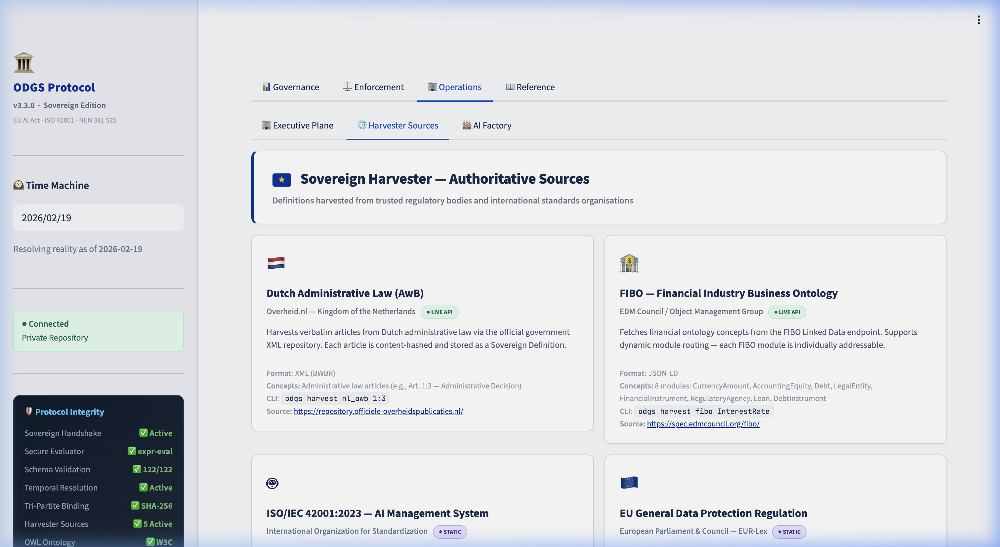
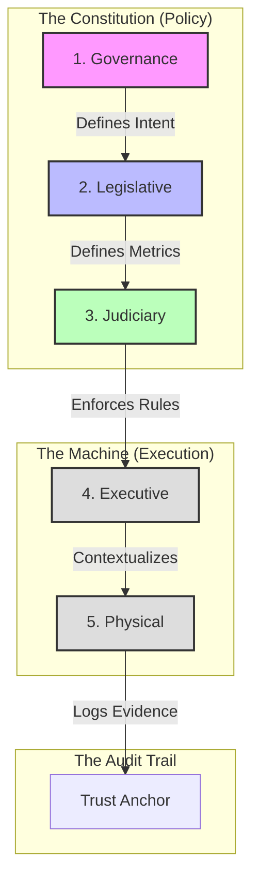

# Open Data Governance Standard (ODGS)

[-0055AA)](https://metricprovenance.com)
[](GOVERNANCE.md)
[](https://doi.org/10.5281/zenodo.18564270)
[](https://pypistats.org/packages/odgs)
[](https://www.npmjs.com/package/odgs)
[](LICENSE)

> **The Universal Validation Engine for High-Risk Data (Candidate Standard for CEN/CENELEC).**

---

### 🏛️ Standards Refactor: Universal Engine Architecture (v4.0.0)

**Notice to all Data Engineers and Architects:**
The repository structure has been formally reorganized to align with the structural directives of the **Royal Netherlands Standardization Institute (NEN)** and reflects the federated data sovereignty principles championed by leading European applied science institutes (e.g., TNO). 

To strictly enforce the semantic decoupling of policy from execution, all materials are now divided into:
1. `1_NORMATIVE_SPECIFICATION/`: Mandatory cryptographic schemas, rules, and W3C OWL ontologies.
2. `2_INFORMATIVE_REFERENCE/`: The software implementation (`odgs` universal engine), adapters, and documentation.

## 1. The Standard: Data Governance Without Compromise

The **Open Data Governance Standard (ODGS)** is a vendor-neutral protocol for **Universal Data Governance**. It resolves the "Definition-Execution Gap" in data pipelines by creating a deterministic method for **Administrative Recusal ("Hard Stop")**.

> **"Silence over Error."** — The Core Philosophy.
> If data drifts from its legal, contractual, or internal definition, the pipeline must mathematically **halt** rather than process an invalid inference.

ODGS parses any text-based agreement into mechanical constraints via Draft-7 JSON Schemas, verifying identities via JWKS cryptography, and outputting mathematically pure, vendor-neutral audit logs.

### See It In Action → [demo.metricprovenance.com](https://demo.metricprovenance.com)

**Semantic Certificate** — Every sovereign definition carries a cryptographic fingerprint bound to its issuing authority. The data equivalent of a TLS certificate.


<details>
<summary><b>📊 More Screenshots</b> — Compliance Matrix · Sovereign Brake · Harvester Sources</summary>

**Sovereign Compliance Matrix** — Real-time governance status across 72 business metrics, aligned with EU AI Act Art. 10 & 12.


**Sovereign Brake — Live Interceptor** — When data does not match its statutory definition, the system *refuses to proceed*. This is the "Administrative Recusal" principle.


**Sovereign Harvester — Authoritative Sources** — Definitions harvested from trusted regulatory bodies and international standards organisations.



</details>

---

## 2. Quick Start: The Data Engineer Workflow

Stop relying on generic analytics failures. Enforce your SLAs, SOC2 policies, and data quality checks directly in your Python transforms.

### Install
```bash
pip install odgs==4.0.0
```

### Example: Halting a Pipeline in Python/dbt
Inject ODGS directly into your data warehouse transforms, Airflow DAGs, or Databricks PySpark wrappers:

```python
from odgs.executive.interceptor import OdgsInterceptor
from odgs.executive.exceptions import ProcessBlockedException

engine = OdgsInterceptor()

# The payload (e.g., a row from pandas or a dbt pre-hook validation)
payload = {"transaction_value": 150000, "aml_flag": False}

try:
    # Evaluate against your internal threshold rules
    engine.intercept("urn:odgs:custom:aml-check", payload)
    print("Payload Validated. Proceeding with database insert.")
    
except ProcessBlockedException as e:
    # The pipeline HALTS before bad data is merged or a model is trained
    print(f"PIPELINE HALTED: {e}")
```

---

## 3. The Ecosystem: URN Namespace Routing

ODGS v4.0.0 routes logic based on **Uniform Resource Names (URNs)**.

### 🟢 Free & Internal (`urn:odgs:custom:*`)
Completely free, offline namespaces for your internal developer usage (Data Quality, B2B SLAs, SOC2 limits, ETL checks).
*   **Routing:** Automatically loads from your local workspace (`./schemas/custom/`).
*   **Execution:** 100% free, local, with agnostic audit logging.

### 🔵 The Sovereign Tier (`urn:odgs:sov:*`)
Premium Sovereign configurations (EU AI Act, GDPR, DORA) cryptographically signed by the **Metric Provenance Root Authority**.
*   **Routing:** Enforces the Sovereign Handshake and loads statutory packs from secure enterprise mounts (`/etc/odgs/law-packs/`).
*   **Liability:** Provides immediate cryptographic proof and legal indemnity that your pipeline mathematically bounds its execution within the exact letter of the law.

---

## 4. Extensibility: Bring Your Own Architecture

We built ODGS to be the "Linux of Data Governance". It injects anywhere.

ODGS implements a "Constitutional Stack" where mechanical execution is legally bound by semantic definitions via the **Universal Interceptor**.


```mermaid
graph TD
    subgraph "The Constitution (Policy)"
        L[1. Governance] -->|Defines Intent| Leg[2. Legislative]
        Leg -->|Defines Metrics| Jud[3. Judiciary]
    end
    subgraph "The Machine (Execution)"
        Jud -->|Enforces Rules| Ex[4. Executive]
        Ex -->|Contextualizes| Phy[5. Physical]
    end
    subgraph "The Audit Trail"
        Phy -->|Logs Evidence| Anchor[Trust Anchor]
    end
    style L fill:#f9f,stroke:#333,stroke-width:2px
    style Leg fill:#bbf,stroke:#333,stroke-width:2px
    style Jud fill:#bfb,stroke:#333,stroke-width:2px
    style Ex fill:#ddd,stroke:#333,stroke-width:2px
    style Phy fill:#ddd,stroke:#333,stroke-width:2px
```

### 🏭 The HarvesterFactory (Bring Your Own Blueprints)
You don't just have to use our Law Packs. Your internal teams or engineering partners (e.g., Deloitte, Capgemini) can write custom Python blueprints to automatically harvest and serialize your proprietary PDF contracts, API specifications, or Notion pages into executable ODGS JSON rule schemas.

### 🔌 The AdapterRegistry (Bring Your Own Integrations)
ODGS is headless. Using the `AdapterRegistry`, you can inject custom Python hooks to serialize rule execution plans back and forth to your proprietary systems (e.g., Rust backends, Kafka streams, Databricks clusters) without waiting for us to build the integration.

> **[Read the Adapter Guide →](2_INFORMATIVE_REFERENCE/architecture/adapter_guide.md)**

---

## 5. Audit Ledgers: Cryptographic Verifiability

ODGS outputs an agnostic `cryptographic_attestation` JSON schema. By generating a **Tri-Partite Hash** (binding the Input Data Hash + the Rule Definition Hash + the Engine Configuration Hash), independent auditors, regulatory bodies, and civil society public watchdogs can mechanically verify the integrity of algorithmic decisions without exposing PI.

---

## 6. Enterprise Deployment (Kubernetes / Helm)

For organization-wide policy enforcement, Sovereign Nodes can deploy ODGS as an active sidecar container routing mesh traffic.

```bash
# Add the Official Metric Provenance Repository
helm repo add metricprovenance https://charts.metricprovenance.com
helm repo update

# Install the Engine
helm install odgs-cluster-agent metricprovenance/odgs-engine \
  --set configuration.namespace="urn:odgs:sov" \
  --set keys.jwks_url="https://platform.metricprovenance.com/.well-known/jwks.json"
```

To request architectural clearance for your organization's compliance deployment, please consult the [Metric Provenance Enterprise Portal](https://platform.metricprovenance.com).

---

## 7. Documentation & Contribution

> 📚 **[Full Documentation Map →](2_INFORMATIVE_REFERENCE/architecture/index.md)**
> 🎯 **[Live Demo →](https://demo.metricprovenance.com)**

| Guide | Description |
|---|---|
| [Migration Guide (v3.3 -> v4.0)](/MIGRATION_GUIDE.md) | Critical instructions for upgrading to URN Namespace Routing. |
| [Adapter Guide](2_INFORMATIVE_REFERENCE/architecture/adapter_guide.md) | For Data Engineers connecting ODGS to custom infrastructures. |
| [Harvester Guide](2_INFORMATIVE_REFERENCE/architecture/harvester_guide.md) | For implementing dynamic parsing blueprints. |
| [Audit Ledger Guide](2_INFORMATIVE_REFERENCE/architecture/audit_ledger_guide.md) | For Big 4 Auditors verifying the Tri-Partite Hash. |

### License
Released under the **Apache 2.0 License**.

* **No Vendor Lock-in.**
* **No Cloud Dependency.**
* **100% Data Sovereignty.**
