# ODGS Protocol v2.0.0
### The Sovereign Engine for Semantic Integrity in High-Risk AI Systems

> **Legal Reference**: Compliant with **Regulation (EU) 2024/1689 (EU AI Act)**, Article 10 (Data Governance) and Article 12 (Record-Keeping).

  

---

## 🚀 Quick Start

The ODGS Protocol is a "Hub & Spoke" toolchain.
*   **The Hub (Python)**: The Definition Engine & CLI. Used to define, hash, and sign protocols.
*   **The Spoke (Node.js)**: The Runtime Client. Used to enforce protocols in JS/React apps.

### 1. Installation

**For Data Engineers & Architects (The Hub):**
```bash
pip install odgs
```

**For App Developers (The Spoke):**
```bash
npm install odgs
# Optional: Install Python CLI for project scaffolding
pip install odgs
```

### 2. Usage

#### Initialize a Sovereign Protocol
```bash
odgs init my_protocol
cd my_protocol
# Created: /legislative, /executive, /judiciary
```

#### Hash & Bind (The Cryptographic Handshake)
```bash
odgs hash
# Output: [INFO] Legislative Plane Hash: sha256:7f9a2b90...
```

---

## 1. Abstract
The Open Data Governance Standard (ODGS) is a vendor-neutral protocol for the **cryptographic enforcement of Semantic Integrity**.

Unlike traditional data catalogs that passively observe metadata ("The Phonebook"), ODGS functions as a **Runtime Interceptor** ("The Border Control"). It binds data payloads to their legal definitions at the millisecond of execution, throwing a `ProcessBlockedException` (Hard Stop) if the semantic binding is violated.

---

## 2. The 3-Plane Architecture
ODGS enforces the separation of powers required by sovereign data ecosystems.

| Plane | Role | Function |
| :--- | :--- | :--- |
| **🏛️ Legislative** | **The Definition** | Defines *WHAT* must be governed (KPIs, Relationships, Quality Standards). |
| **⚖️ Judiciary** | **The Enforcer** | Defines *HOW* to validate it (Logic, Limits, Failure Diagnosis). |
| **⚔️ Executive** | **The Execution** | Defines *WHERE* it applies (Lifecycle Stage, Database Bindings). |

---

## 3. The Sequence of Denial (How it Works)
The ODGS Interceptor performs a **Cryptographic Handshake** before allowing data consumption.

```mermaid
sequenceDiagram
    participant AI as AI Agent / Application
    participant G as ODGS Guard (Interceptor)
    participant L as Legislative Plane (JSON)
    
    AI->>G: 1. Request Data (Payload + ContextID)
    G->>L: 2. Fetch Immutable Definition & Hash
    L-->>G: 3. Return Hash (e.g., sha256:7f9a...)
    G->>G: 4. VALIDATE BINDING (Hash Match?)
    
    alt SEMANTIC DRIFT DETECTED
        G-->>AI: 5. ⛔ HARD STOP (ProcessBlockedException)
        G->>Log: 6. Write to Audit Log (Art. 12)
    else CLEAN HANDSHAKE
        G-->>AI: 5. 🟢 PASS (Signed Data Object)
    end
```



---

## 4. Code Examples

### Python (The Engine)
```python
from odgs import OdgsInterceptor, ProcessBlockedException

guard = OdgsInterceptor()

try:
    guard.intercept(
        process_urn="urn:odgs:process:O2C_S03", 
        required_integrity_hash="sha256:7f9a2b90cc...", 
        data_context={"container_id": "INVALID 123"}
    )
except ProcessBlockedException as e:
    print(f"⛔ HARD STOP: {e}")
    sys.exit(1)
```

### Node.js (The Client)
```javascript
import { OdgsInterceptor, ProcessBlockedException } from 'odgs';

const guard = new OdgsInterceptor();

try {
  guard.intercept(
    "urn:odgs:process:O2C_S03", 
    { container_id: "BAD_ID" },
    "sha256:7f9a2b90cc..."
  );
} catch (e) {
  console.error("⛔ JS HARD STOP: Blocked by ODGS Protocol.");
}
```

---

## 5. Reference Artifacts

| Artifact | EU AI Act Alignment |
| --- | --- |
| `/legislative/standard_metrics.json` | **Art. 10**: Data Governance & Management |
| `/schemas/audit_log_v1.json` | **Art. 12**: Technical Documentation & Logs |

---

## ⚠️ Legal Disclaimer

**ODGS provides the technical capability for Article 10 & 12 compliance; it does not guarantee legal immunity.**

The Organization (User) remains the sole Liability Holder. ODGS is the mechanism (The Lock); the Organization is responsible for the policy (The Key). This software is provided "as is," without warranty of any kind, express or implied.
