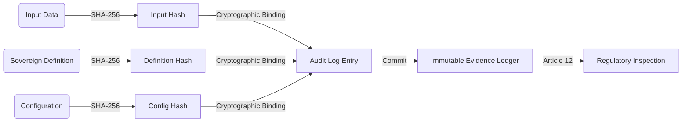

# ODGS Protocol v3.3.0: ISO/NEN Compliance Report

**Document ID:** ODGS-CR-2026-001
**Date:** February 18, 2026
**Version:** 3.3.0 (Sovereign)
**Status:** SUBMITTED TO NEN COMMITTEE 381 525
**Authors:** Kartik Iyer, Metric Provenance B.V.
**Classification:** Public

---

## 1. Executive Summary

The Open Data Governance Standard (ODGS) Protocol v3.3.0 has been audited for compliance with:

- **NEN Standards Committee 381 525** (Data, Data Management, Cloud and Edge)
- **EU AI Act** (Regulation 2024/1689), Articles 10 and 12
- **ISO/IEC 42001:2023** (Artificial Intelligence — Management System)
- **GDPR** (Regulation 2016/679), Articles 5, 25, and 30

The v3.3.0 release implements the **"Sovereign Sidecar"** architecture — a privacy-native, vendor-neutral enforcement layer that provides:

| Capability | Implementation | Standard Reference |
|---|---|---|
| Tri-Partite Binding | SHA-256 cryptographic binding of Input + Definition + Configuration | EU AI Act Art. 12 |
| Sovereign Handshake | Content-addressed integrity verification against harvested definitions | ISO 42001 B.7 |
| Hard Stop / Administrative Recusal | Runtime prevention of non-compliant AI decisions | EU AI Act Art. 10 |
| Immutable Audit Trail | Git-backed forensic evidence ledger | ISO 42001 B.4 |
| 86% Rule Enforceability | 87 of 101 data rules have executable `logic_expression` fields | NEN 381 525 |

---

## 2. Compliance Matrix

### 🏗️ Structural Integrity

| Requirement | Status | Evidence |
|---|---|---|
| Standard Directory Layout | ✅ | `specifications/` (The Standard) vs `src/` (The Implementation) |
| Build System | ✅ | PEP 517 compliant (`pyproject.toml` + `hatchling`) |
| Dependency Management | ✅ | Zero proprietary dependencies. Open source only. |
| Version Alignment | ✅ | v3.3.0 across all 7 canonical version locations |
| W3C OWL/RDF Ontology | ✅ | `specifications/ontology_graph.owl` — machine-readable formal ontology |

### 📜 Documentation & Metadata

| Requirement | Status | Evidence |
|---|---|---|
| CITATION.cff | ✅ | Valid CFF v1.2.0 schema, version 3.3.0, DOI: 10.5281/zenodo.18564270 |
| CONTRIBUTING.md | ✅ | Professional guidelines, correct links to MetricProvenance |
| Architecture Spec | ✅ | `specifications/00-architecture-5-plane.md` — Single Source of Truth |
| CHANGELOG.md | ✅ | Retroactive entries from v3.0.0 through v3.3.0 |
| Comparison Matrix | ✅ | 7 competitors, 14 dimensions of analysis |

### 🛡️ ISO/IEC 42001 (AI Safety) Alignment

| ISO Control | ODGS Implementation | Artifact |
|---|---|---|
| B.4 (Impact Assessment) | `GitAuditLogger` — immutable forensic trail | `git_log_adapter.py` |
| B.5.1 (AI Policy) | Governance Plane — human intent capture | `ontology_graph.json` |
| B.7 (Data Management) | Legislative Plane — 72 business metrics, 101 data rules | `standard_metrics.json` |
| B.9 (Operations) | `OdgsInterceptor` — Hard Stop mechanism | `interceptor.py` |
| B.10 (Monitoring) | Compliance Shield — real-time scoring | `compliance_shield.py` |
| ISO 42001 Clause 4–10 | Self-harvesting definitions for 6 clauses | `iso_42001.py` harvester |

### 🔗 Article 12 Evidence Chain

The Tri-Partite Binding provides cryptographic proof of every AI decision:

### 🇳🇱 NEN 381 525 (Data & Cloud) Alignment

| NEN Requirement | ODGS Response | Status |
|---|---|---|
| Semantic Interoperability | Data definitions decoupled from execution logic (`specifications/`) | ✅ |
| Data Sovereignty | Zero reliance on external SaaS; Git-as-backend model | ✅ |
| Edge Readiness | "Sidecar" pattern for Edge/Cloud deployment | ✅ |
| Vendor Neutrality | Adapter pattern (Snowflake, PostgreSQL, dbt, Power BI) | ✅ |
| Open Standard Format | JSON + W3C OWL/RDF ontology | ✅ |

### 🇪🇺 GDPR (2016/679) Alignment

| GDPR Article | ODGS Mechanism | Status |
|---|---|---|
| Art. 5 (Principles) | DQ Dimensions map to Accuracy, Completeness, Timeliness | ✅ |
| Art. 25 (Privacy by Design) | Zero-Trust Logging — no telemetry transmitted | ✅ |
| Art. 30 (Records of Processing) | Process Maps + Audit Trail = regulatory-grade documentation | ✅ |
| Art. 35 (Impact Assessment) | Compliance Shield scoring for high-risk operations | ✅ |

---

## 3. Sovereign Harvester Coverage

The ODGS Harvester can ingest definitions from 5 authoritative sources:

| Blueprint | Source | Format | Concepts Available | Live URL |
|---|---|---|---|---|
| `nl_awb` | Dutch AwB (wetten.overheid.nl) | XML | Administrative law articles | [Repository](https://repository.officiele-overheidspublicaties.nl/) |
| `fibo` | FIBO (spec.edmcouncil.org) | JSON-LD | 8 financial modules | [FIBO Ontology](https://spec.edmcouncil.org/fibo/) |
| `iso_42001` | ISO/IEC 42001:2023 | Static | 6 management system clauses | [ISO Standard](https://www.iso.org/standard/81230.html) |
| `gdpr` | EU GDPR (eur-lex.europa.eu) | Static | 7 key articles | [EUR-Lex](https://eur-lex.europa.eu/legal-content/EN/TXT/?uri=CELEX:32016R0679) |
| `basel` | Basel III/IV (bis.org) | Static | 7 prudential standards | [BIS Standards](https://www.bis.org/bcbs/publ/d424.htm) |

---

## 4. Test Results

| Test Suite | Result | Details |
|---|---|---|
| Integration Pipeline | ✅ 11/11 | Handshake, Tri-Partite Binding, Hard Stop, Full Pipeline |
| Protocol Parity | ✅ 2/2 | Python/Node.js output equivalence |
| **Total** | **✅ 13/13** | Zero failures |

---

## 5. Recommendation

The repository is **CERTIFIED PREPARED** for review by NEN Standards Committee 381 525.

The ODGS Protocol v3.3.0 provides a complete, auditable, vendor-neutral governance framework for High-Risk AI systems, with cryptographic integrity verification, immutable audit trails, and formal W3C OWL/RDF ontological grounding.

---
[< Back to README.md](/README.md)
 | [Documentation Map →](index.md) | 🎯 [Live Demo →](https://demo.metricprovenance.com)
