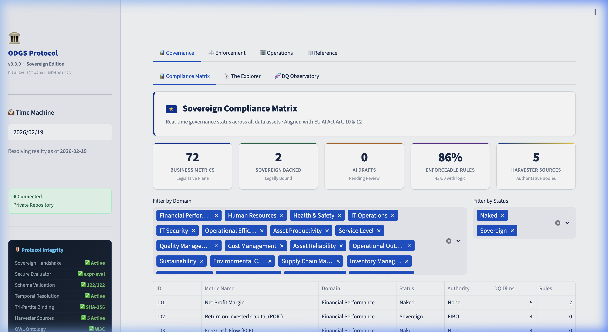
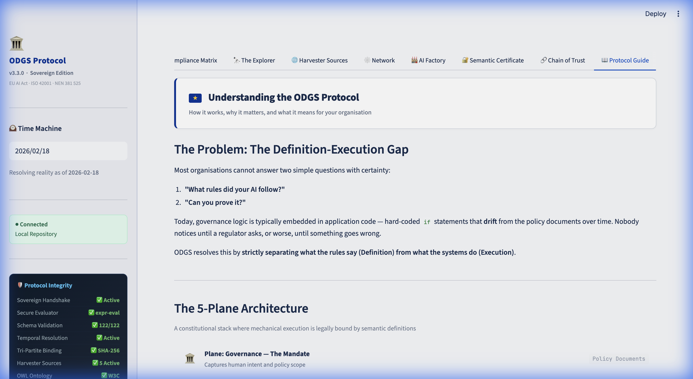
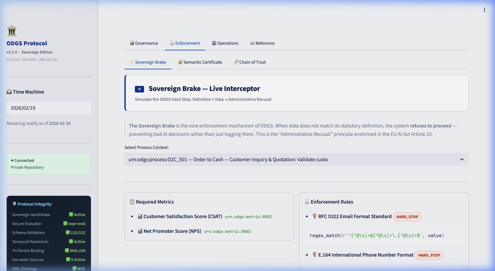

# Understanding ODGS: A Plain Language Guide

**What is ODGS?** How it works, why it matters, and what it means for your organization.

---

## The Problem: Data Governance is Broken

Imagine you're a bank, and your AI system approves a loan. Two questions regulators will ask:

1. **"What rules did your AI follow?"**
2. **"Can you prove it?"**

Most organizations can't answer either question with certainty. Here's why:

### The Spreadsheet Problem

Today, data governance typically looks like this:
- Someone writes rules in a **Word document** or **Excel spreadsheet**
- A developer reads those rules and **hard-codes them** into the software
- Over time, the rules in the document **drift** from the rules in the code
- Nobody notices until something goes wrong

This is called the **"Definition-Execution Gap"** — the disconnect between what your governance *says* and what your systems actually *do*.

### What Goes Wrong

| What Happens | Real World Example | Consequence |
|---|---|---|
| Rules are outdated | Housing guarantee limit changed but code wasn't updated | Fraudulent loans approved |
| No proof of decisions | AI rejected an application but can't explain why | Regulatory fine |
| Different systems, different rules | Marketing database says "VIP", billing says "Inactive" | Wrong decisions made |

---

## The Solution: ODGS

ODGS is a **standard protocol** (like HTTPS for websites, but for data governance) that solves this by doing three things:

### 1. 📜 Write the Rules Once, Use Them Everywhere

Instead of embedding rules in code, ODGS stores them in simple **JSON files** that any system can read:

```
Rule: "Every financial transaction must have a valid Chart of Accounts code"
Severity: HARD STOP (if this fails, the system refuses to proceed)
```

**In plain English:** Think of it like a recipe card. Instead of every chef memorizing the recipe, you write it on a card and put it in the kitchen. If the recipe changes, you update the card — not retrain every chef.

### 2. 🛡️ If Something is Wrong, Stop

When data flows through a system connected to ODGS, the protocol checks it against the rules. If something doesn't match:

- **Hard Stop:** The system refuses to proceed. No bad data gets through.
- **Warning:** The system flags the issue but continues.
- **Info:** The system logs it for later review.

**In plain English:** It's like a smoke detector for data. If something's wrong, it sounds the alarm *before* the fire spreads.

### 3. 🔐 Prove Everything

Every decision the system makes is **cryptographically signed** and stored, creating an unbreakable chain of evidence:

- **What data** was processed (without revealing the actual data — privacy preserved)
- **Which rule** was applied
- **What happened** (approved, rejected, flagged)

**In plain English:** It's like a flight recorder (black box) for your AI. Regulators can always go back and verify exactly what happened and why.

---

## Who Is This For?

| Role | What ODGS Does For You |
|---|---|
| **CEO / Board** | Reduces regulatory risk. Provides evidence of "due diligence" for AI decisions. |
| **Chief Data Officer** | Single source of truth for all data governance rules across the organization. |
| **Compliance Officer** | Pre-built alignment with EU AI Act, GDPR, ISO 42001, and Basel III. |
| **Data Engineer** | Drop-in sidecar that works with Snowflake, PostgreSQL, dbt, Power BI — no rip-and-replace. |
| **Regulator / Auditor** | Machine-readable governance that can be validated with standard W3C tools. |
| **General Public** | Assurance that AI systems handling your data are operating within defined safety limits. |

---

## How Does It Work? (5-Minute Version)

Think of ODGS as a government for your data:

```
🏛️  GOVERNANCE      →  The Constitution       →  "What do we stand for?"
📜  LEGISLATIVE      →  The Laws               →  "What are the rules?"
⚖️  JUDICIARY        →  The Courts              →  "Is this data following the rules?"
🏢  EXECUTIVE        →  The Administration      →  "In what context do we apply the rules?"
🔌  PHYSICAL         →  The Real World           →  "The actual data"
```

**Step 1:** Your organization defines its rules (e.g., "Net Profit Margin = Net Income ÷ Revenue × 100").

**Step 2:** ODGS stores these rules in tamper-proof files with a unique fingerprint (SHA-256 hash).

**Step 3:** When your AI system processes data, ODGS checks it against the rules in real time.

**Step 4:** If something is wrong, ODGS stops the process and logs exactly what happened.

**Step 5:** All evidence is stored in your own private repository (not in anyone else's cloud).

---

## What Makes ODGS Different?

| Feature | Traditional DG Tools | ODGS |
|---|---|---|
| Where rules live | Embedded in code | External JSON files (like a constitution) |
| What happens when rules are broken | Nothing (or a log nobody reads) | **Hard Stop** — system refuses to proceed |
| Proof of compliance | Screenshots and manual reports | Cryptographic evidence chain |
| Vendor lock-in | Tied to one platform | Works with any platform (open protocol) |
| Data sovereignty | Your data on someone else's cloud | Your data stays in your infrastructure |
| Regulatory alignment | Manual mapping | Pre-built (EU AI Act, GDPR, ISO 42001, Basel III) |

---

## The Trusted Sources

ODGS doesn't make up rules — it harvests definitions from **authoritative, trusted sources**:

| Source | What It Provides | Example |
|---|---|---|
| 🇪🇺 **EU GDPR** | Data protection requirements | "Personal data must be accurate and kept up to date" |
| 🏦 **FIBO** | Financial industry definitions | "Interest Rate: the ratio of interest paid to principal" |
| 🇳🇱 **Dutch AwB** | Administrative law articles | "Legal definition of an administrative decision" |
| 🤖 **ISO 42001** | AI management system controls | "Organizations shall manage data quality for AI systems" |
| 🏛️ **Basel III** | Banking prudential standards | "CET1 Capital Ratio must be at least 4.5%" |

These definitions are **content-hashed** — meaning if anyone changes them, the system immediately detects the tampering.

## See It In Action

ODGS includes an interactive dashboard. Here's what it looks like:

### Compliance Matrix — Real-Time KPIs



The main dashboard shows live governance status: how many metrics are registered, how many are backed by sovereign definitions, and the overall enforceability rate.

### Harvester Sources — The 5 Trusted Authorities


Each source card shows the authority, format, CLI command, and live URL — providing full transparency on where every definition originates.

### Protocol Guide — Architecture Made Visual



The built-in Protocol Guide explains the 5-Plane Architecture, key innovations, and standards alignment — directly within the tool.

### Semantic Certificate — The Proof


Every sovereign definition carries a cryptographic fingerprint bound to its issuing authority — the data equivalent of a TLS certificate. If anyone changes the definition, the system detects it instantly.

### Sovereign Brake — The Hard Stop



When data does not match its statutory definition, the system refuses to proceed — preventing bad AI decisions rather than just logging them. This is the "Administrative Recusal" principle enshrined in the EU AI Act Article 10.

> **Try it yourself:** Visit [demo.metricprovenance.com](https://demo.metricprovenance.com) or run `odgs ui` locally.

---

## Getting Started

### If You're an Executive
→ Read the [Technical Note v3.3](research/technical_note_v33.md) for the strategic case

### If You're a Technical Leader
→ Read the [Technical Annex](technical_annex.md) for architecture details

### If You're a Developer
→ Read the [Adapter Guide](adapter_guide.md) to integrate with your platform

### If You're a Regulator
→ Review the [Compliance Report](compliance_report.md) for standards alignment

---

## FAQ

**Q: Is this just another data quality tool?**
A: No. Data quality tools *measure* problems. ODGS *prevents* them by stopping non-compliant data at the gate.

**Q: Do I need to replace my existing systems?**
A: No. ODGS works as a "sidecar" alongside your existing infrastructure (Snowflake, PostgreSQL, etc.).

**Q: Is my data sent to a third party?**
A: Never. ODGS operates entirely within your infrastructure. Zero telemetry.

**Q: Is this open source?**
A: Yes. Apache 2.0 license. The protocol and reference implementation are freely available.

**Q: How does this help with the EU AI Act?**
A: The EU AI Act requires "High-Risk AI systems" to have documented data governance (Art. 10) and automatic event recording (Art. 12). ODGS provides both out of the box.

---

*Have questions? Visit [metricprovenance.com](https://metricprovenance.com) or read the full [Technical Specification](technical_annex.md).*

---

📚 **All Documentation:** [Documentation Map →](index.md) · 🎯 **Live Demo:** [demo.metricprovenance.com](https://demo.metricprovenance.com)
