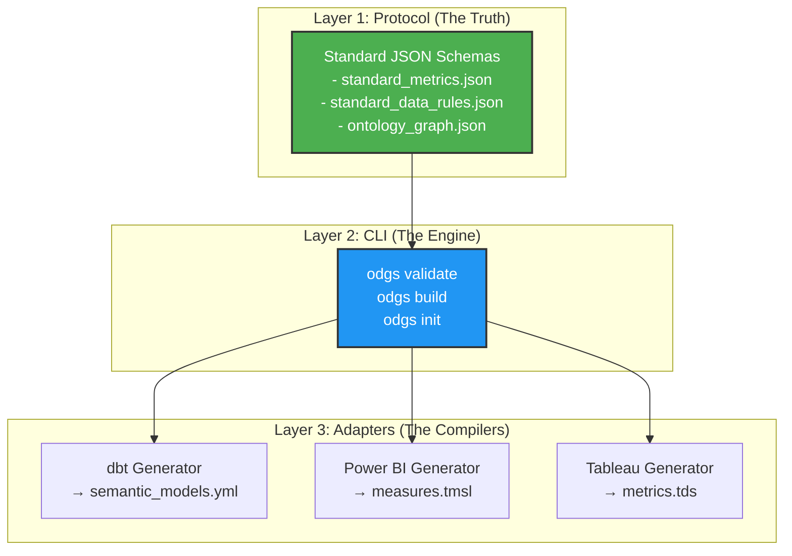
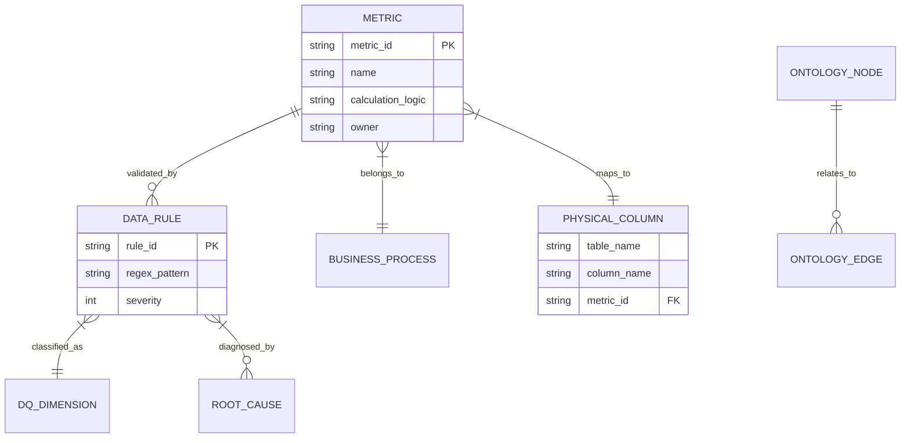

# The Complete ODGS Guide

[](https://opensource.org/licenses/Apache-2.0)
[]()
[]()

> **"The Protocol for Algorithmic Accountability"**

**From Concept to Implementation**

---

## Part 1: Understanding ODGS

### The Problem: "Why Doesn't the Volume Match?"

Imagine you have a TV, a Soundbar, and a Cable Box. You turn up the volume on the TV, but the Soundbar stays quiet. You try the Cable remote, and it changes the channel instead. You have three devices, three remotes, and **no unified control**.

**Data is exactly the same.**

Your company defines "Revenue" in three places:
1. **The Database** (Snowflake SQL)
2. **The Dashboard** (Power BI DAX)  
3. **The Excel Sheet** (Finance formulas)

When these don't match, we call it **Metric Drift**. It used to be annoying—requiring meetings to reconcile numbers. **With AI, it's dangerous.**

If an AI Agent asks the Database for "Revenue", it gets one number. If it asks the Dashboard, it gets another. The AI doesn't know which is real, so it guesses. Studies show LLMs hallucinate ~20% of the time on numerical queries without grounding.

### The Solution: Headless Data Governance

**ODGS (Open Data Governance Schema)** is like a **Universal Remote**. Instead of setting the volume on three different devices, you set it **once** on the Universal Remote, and it automatically syncs to the TV, Soundbar, and Cable Box.

With ODGS:
1. You define "Revenue" **once** in a standard JSON file
2. ODGS compiles that definition to **Snowflake SQL**, **Power BI DAX**, and **dbt YAML**
3. When an AI Agent asks for "Revenue", it reads the ODGS Protocol to get the *exact* verified answer

This is called **"Headless Governance"** because it doesn't have a UI of its own—it works in the background, making your existing tools smarter.

---

### The Architecture

ODGS operates as a **3-Layer System**:



 - **Layer 1** stores the canonical definitions.  
 - **Layer 2** validates and orchestrates builds.  
 - **Layer 3** compiles to tool-native formats.

---

## Part 2: Getting Started

### Installation

ODGS is available as both a Python package and an NPM module.

**Python:**
```bash
pip install odgs
```

**Node.js:**
```bash
npm install odgs
```

### Quickstart (5 Steps)

#### Step 1: Initialize a Project

```bash
odgs init my-governance-layer
cd my-governance-layer
```

This creates the `protocol/` directory structure:
```
protocol/
├── lib/
│   ├── standard_metrics.json
│   ├── standard_data_rules.json
│   ├── standard_dq_dimensions.json
│   ├── root_cause_factors.json
│   ├── business_process_maps.json
│   ├── physical_data_map.json
│   └── ontology_graph.json
└── schemas/
    └── metric.schema.json
```

#### Step 2: Define Your First Metric

Open `protocol/lib/standard_metrics.json` and add a metric:

```json
[
  {
    "metric_id": "KPI_101",
    "name": "Gross_Revenue",
    "domain": "Sales",
    "definition": "Total revenue from paid transactions, excluding refunds",
    "calculation_logic": {
      "abstract": "SUM(Amount) WHERE Status = 'Paid'",
      "sql_standard": "SUM(amount) WHERE status = 'paid' AND refund_flag = FALSE"
    },
    "owner": "Finance_Team",
    "status": "Active",
    "compliance": {
      "ai_risk_level": "High",
      "gdpr_pii": false,
      "data_classification": "Internal"
    }
  }
]
```

#### Step 3: Validate

Ensure your definitions strictly adhere to the protocol:

```bash
odgs validate
```

**Expected Output:**
```
🔍 Running ODGS Validator...
✅ Loaded 1 metric from standard_metrics.json
✅ Schema validation passed
✅ Referential integrity check passed
🎉 All governance checks passed!
```

#### Step 4: Build Artifacts

Compile your JSON into tool-specific configurations:

```bash
odgs build --target all
```

**Generated Files:**
- `adapters/dbt/semantic_models.yml` (for dbt MetricFlow)
- `adapters/powerbi/measures.tmsl` (for Power BI)  
- `adapters/tableau/metrics.tds` (for Tableau)

#### Step 5: Deploy to Your Tools

Copy the generated files to your tool's configuration directory:

```bash
# For dbt
cp adapters/dbt/semantic_models.yml ~/my-dbt-project/models/

# For Power BI (via Tabular Editor)
# Import adapters/powerbi/measures.tmsl using XMLA endpoint
```

---

## Part 3: The Protocol Specification

### The 7 Core Schemas

ODGS consists of 7 interconnected JSON schemas. Each serves a specific purpose in the governance graph.

| Schema | Purpose | Key Question Answered |
|:---|:---|:---|
| **standard_metrics.json** | KPI Definitions | "How do we calculate Churn?" |
| **standard_data_rules.json** | Validation Rules | "Is this data valid?" |
| **standard_dq_dimensions.json** | Quality Categories | "Which quality aspect is affected?" |
| **root_cause_factors.json** | Failure Taxonomy | "Why is the data broken?" |
| **business_process_maps.json** | Process Context | "Where is this data created?" |
| **physical_data_map.json** | Physical Binding | "Which table/column stores this?" |
| **ontology_graph.json** | Knowledge Graph | "How do entities relate?" |

### Schema Deep Dive

#### 1. Metric Object (`standard_metrics.json`)

**Core Fields:**

| Field | Type | Required | Description |
|:---|:---|:---|:---|
| `metric_id` | String | ✅ | Unique immutable identifier (e.g., `KPI_001`) |
| `name` | String | ✅ | Human-readable business name |
| `domain` | String | ✅ | Business domain (Sales, Finance, Operations) |
| `definition` | String | ✅ | Functional description in plain English |
| `calculation_logic` | Object | ✅ | Dictionary of logic (abstract, SQL, DAX) |
| `owner` | String | ✅ | Responsible team or individual |
| `status` | Enum | ✅ | `Draft`, `Active`, `Deprecated` |

**Enhanced Fields (v1.2+):**

| Field | Type | Description |
|:---|:---|:---|
| `icon` | String | Bootstrap Icon class (e.g., `bi-graph-up`) |
| `targetIndustries` | Array | Industry tags (`Retail`, `Healthcare`) |
| `criticalDqDimensionIds` | Array | Links to quality dimensions |
| `metadata` | Object | Version, timestamps, changelog |
| `compliance` | Object | Regulatory tags (GDPR, AI Risk) |
| `lineage` | Object | Upstream dependencies |

**Compliance Object:**

Used for **EU AI Act** and **GDPR** tagging.

```json
"compliance": {
  "ai_risk_level": "High",
  "gdpr_pii": true,
  "data_classification": "Confidential"
}
```

**Lineage Object:**

Defines the dependency graph for **Metric Provenance**.

```json
"lineage": {
  "upstream_metric_ids": ["KPI_099", "KPI_098"],
  "source_systems": ["Snowflake.Raw.Orders", "Salesforce.Accounts"]
}
```

#### 2. Data Rules (`standard_data_rules.json`)

**Structure:**

```json
{
  "rule_id": "RULE_001",
  "rule_name": "Email_Format_Check",
  "rule_type": "Pattern",
  "technical_logic": {
    "regex": "^[a-zA-Z0-9._%+-]+@[a-zA-Z0-9.-]+\\.[a-zA-Z]{2,}$",
    "sql_check": "email LIKE '%@%.%'"
  },
  "dq_dimension_id": 3,
  "severity": "High"
}
```

#### 3. Ontology Graph (`ontology_graph.json`)

Defines semantic relationships between business entities.

```json
{
  "nodes": [
    {"node_id": "Customer", "type": "Entity"},
    {"node_id": "Order", "type": "Entity"}
  ],
  "relationships": [
    {
      "source": "Customer",
      "target": "Order",
      "type": "places",
      "cardinality": "OneToMany"
    }
  ]
}
```

**Why This Matters for AI:**

When an LLM sees `customer_id` in the Orders table, it can traverse the graph to understand:
- A Customer *places* many Orders
- An Order *belongs to* one Customer
- "Show me customers with >10 orders" is a valid query

---

### The Knowledge Graph Model

While ODGS is stored as flat JSON files, it logically represents a **Knowledge Graph**. References between files (e.g., `metric_id` linking to `rule_id`) form the edges.



**This enables:**
1. **Impact Analysis**: If `Order_ID` format changes, traverse to find all dependent Metrics
2. **Root Cause Diagnosis**: If `Gross_Margin` drops, trace to failed Data Rules and responsible Business Process
3. **AI Context**: Feed the LLM a relevant subgraph instead of the entire schema

---

## Part 4: Advanced Usage

### CLI Reference

#### `odgs init [project_name]`

Initializes a new ODGS project with standard directory structure.

**Options:**
- `--template`: Use a predefined template (retail, healthcare, saas)

**Example:**
```bash
odgs init --template retail my-retail-governance
```

#### `odgs validate [--strict]`

Validates all JSON files against the ODGS schemas.

**Checks:**
- Required fields present
- Correct data types
- Enum values valid
- Referential integrity (IDs exist)

**Flags:**
- `--strict`: Fail on warnings (not just errors)

**Example:**
```bash
odgs validate --strict
```

#### `odgs build [--target <tool>]`

Compiles ODGS definitions into downstream artifacts.

**Targets:**
- `all`: Generate all adapters
- `dbt`: dbt MetricFlow YAML
- `powerbi`: Power BI TMSL
- `tableau`: Tableau TDS

**Example:**
```bash
odgs build --target dbt
```

---

### Adapters & Integrations

#### 1. dbt (Data Build Tool)

**Output:** `semantic_models.yml` (MetricFlow)

**Mapping:**
- `metric_id` → `name`
- `calculation_logic.sql_standard` → `expr`
- `definition` → `description`

**Usage:**
```bash
python3 adapters/dbt/generate_semantic_models.py
```

**Generated File:**
```yaml
semantic_models:
  - name: Gross_Revenue
    description: Total revenue from paid transactions
    type: simple
    expr: SUM(amount) WHERE status = 'paid'
```

#### 2. Microsoft Power BI

**Output:** `measures.tmsl` (Tabular Model Scripting Language)

**Mapping:**
- `name` → `Name`
- `calculation_logic.dax_pattern` → `Expression`
- `format_string` → `FormatString`

**Usage:**
```bash
python3 adapters/powerbi/generate_tmsl.py
```

**Generated File:**
```json
{
  "createOrReplace": {
    "object": {
      "database": "MyModel",
      "table": "Measures"
    },
    "measure": {
      "name": "Gross_Revenue",
      "expression": "SUM('Orders'[Amount])"
    }
  }
}
```

#### 3. Tableau

**Output:** `metrics.tds` (Tableau Data Source XML)

**Usage:**
```bash
python3 adapters/tableau/generate_tds.py
```

---

### Building Custom Adapters

You can create adapters for any tool using Python or Node.js.

**Example (Python):**
```python
import json

# Load the metric definitions
with open('protocol/lib/standard_metrics.json') as f:
    metrics = json.load(f)

# Generate your custom format
for metric in metrics:
    print(f"-- Metric: {metric['name']}")
    print(f"-- Logic: {metric['calculation_logic']['sql_standard']}")
    print()
```

**Best Practices:**
1. Read from `protocol/lib/` (the canonical source)
2. Use Jinja2 for templating
3. Validate generated output before deployment
4. Include comments with ODGS metadata (metric_id, owner)

---

## Next Steps

✅ **Explore the [Strategic Vision](vision.md)** to understand the market opportunity  
✅ **Join the [GitHub Discussions](https://github.com/Authentic-Intelligence-Labs/headless-data-governance/discussions)**  
✅ **Contribute** by expanding the DQ Dimensions or building new adapters
